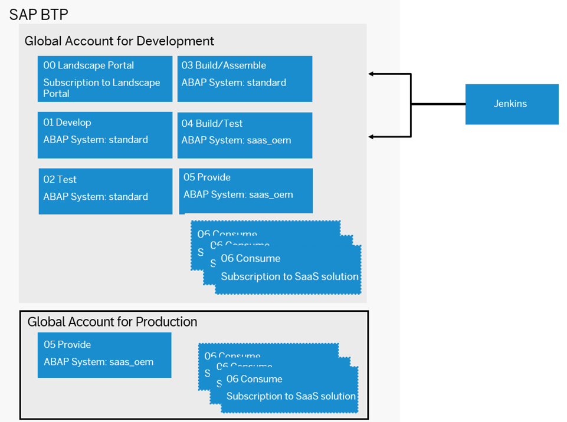
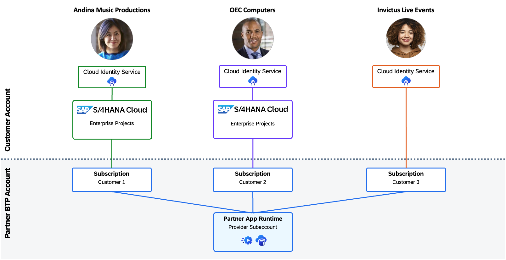

# Bill of Materials

## Overview

To develop and operate the **Music Festival Manager** application with multi-tenancy, SAP ERP integration, and additional features, you need several subaccounts and entitlements. These include:

- **Provider subaccount**: Where the application is deployed
- **Consumer subaccounts**: Where the application is subscribed, containing customer-specific information and configuration

The required landscape setup and components are outlined below.

## Landscape Overview

> [!NOTE]
> SAP Help Portal provides comprehensive details of the preliminary steps you need to perform before you can proceed with the development of the add-on. For more information, see [Prepare](https://help.sap.com/docs/btp/sap-business-technology-platform/prepare?locale=en-US&version=Cloud) on SAP Help Portal.

### Namespace Registration

For production use, add-on development requires a reserved namespace to ensure unique names for add-on products and software components.

However, for the Music Festival Manager application, you're using the Customer (Z) namespace as this is sample application that can be easily imported into any ABAP Cloud system for testing and evaluation. Therefore, when following the steps in this tutorial, **you don't need to register a namespace**.

> [!NOTE]
> For more information about registering a namespace, see [Register a Namespace](https://help.sap.com/docs/btp/sap-business-technology-platform/prepare?locale=en-US&version=Cloud#register-a-namespace) on SAP Help Portal.
>
> If you want to try out the **Delivery Using Add-On** option, you have to register your own namespace as described in the [Register a Namespace](https://help.sap.com/docs/btp/sap-business-technology-platform/prepare?locale=en-US&version=Cloud#register-a-namespace) documentation. If you are just getting started or exploring the Music Festival Manager application, you can continue using the Z-namespace as shown in the tutorials.

### Subaccounts

You need two global accounts on SAP Business Technology Platform:

- **Development**: For development, testing, and demo purposes  
- **Production**: For production deployment and customer consumption

#### Development Global Account Setup

As a SaaS solution operator, you must configure the global account for development (used for development, testing, and demo purposes), and entitle the required services in the corresponding subaccounts.

For more information about the recommended subaccount structure and list of entitlements required, see [Set Up a Global Account for Development](https://help.sap.com/docs/btp/sap-business-technology-platform/prepare?locale=en-US&version=Cloud#set-up-a-global-account-for-development) on SAP Help Portal.

#### Production Global Account Setup

As a SaaS solution operator, you must configure the global account for production. In the provider subaccount, the add-on product is provided as a SaaS solution for production purposes in the production phase. The solution is consumed by your customers from consumer subaccounts.

For more information about the recommended subaccount structure and list of entitlements required, see [Set Up a Global Account for Production](https://help.sap.com/docs/btp/sap-business-technology-platform/prepare?locale=en-US&version=Cloud#set-up-a-global-account-for-production) on SAP Help Portal.

## Additional Entitlements

The Music Festival Manager application includes specific features that need additional entitlements:

| Subaccount | Service                    | Plan     | Type        | Quantity |
| ---------- | -------------------------- | -------- | ----------- | -------- |
| Provider   | SAP AI Core                | extended | Service     | 1        |
| Provider   | SAP Forms service by Adobe | default  | Application | 1        |
| Provider   | SAP Forms service by Adobe | standard | Service     | 1        |

## Applications

**Adobe LiveCycle Designer**: To develop the feature to [manage forms](./41a-Forms-Feature.md), you need to download and install the Adobe LiveCycle Designer application on your local machine. This application is provided by SAP.

## Sample Setup for Music Festival Manager

The example setup serves three sample customers:

- **Andina Music Productions**: A well-established music production company with a strong focus on live events and artist management.
- **OEC Computers**: A company whose employees frequently come together for music jams with a great buffet and all-you-can-eat mousse au chocolat.
- **Invictus Live Events**: A small event management startup that currently doesn't have an ERP solution. However, they show promise as a potential ERP prospect if they continue on their exciting growth journey.

## Sizing

For information about defining the sizing of your application, you can refer to the following resources:

- [**ABAP System Sizing**](https://help.sap.com/docs/sap-btp-abap-environment/abap-environment/abap-system-sizing?locale=en-US) on SAP Help Portal - This documentation describes the principles of system sizing for custom applications in the ABAP environment. It covers several key areas: sizing fundamentals, preparation steps, and measurements using the Capture Request Statistics app. Additionally, you'll learn about the **Perform System Sizing** app.
- [**Sizing for SaaS Applications**](https://help.sap.com/docs/btp/sap-business-technology-platform/saas-apps-order-and-provide?locale=en-US&version=Cloud#deploy) on SAP Help Portal - See the **Sizing** section for information about multitenant application sizing properties including tenant limits, ABAP compute units (runtime), and HANA compute units (persistence) for SaaS offerings.

## Information on Versions and What's New

You can subscribe to updates on the [What's New for SAP Business Technology Platform](https://help.sap.com/whats-new/cf0cb2cb149647329b5d02aa96303f56?clear=all&locale=en-US) on SAP Help Portal.
