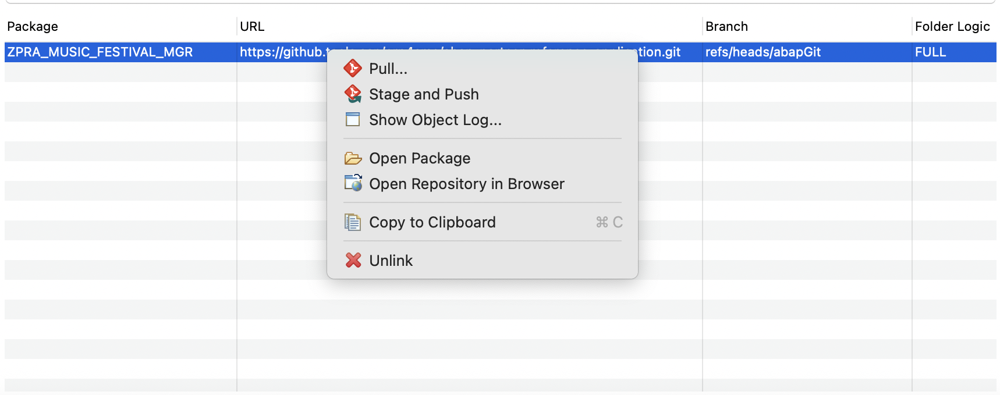

# Deploy and Run the Application

This tutorial offers a step-by-step guide on developing and deploying the Music Festival Manager. Initially, you set it up as a multitenancy solution. Later, you enhance it with SAP S/4HANA Cloud integration and additional features.

If you prefer a quick start without further explanation and want to the application with all features, follow these steps:

1. [Prepare your SAP BTP provider account, SAP Business Application Studio (BAS) and ABAP Development Tools (ADT) for development](./11-Prepare-BTP-Account-ADT-For-Dev.md).

>[!IMPORTANT]
> Update your Eclipse and ABAP Development Tools (ADT) to the latest versions to ensure you have all the necessary features for a smooth experience.

2. [Enable the entitlements mentioned in the bill of materials of the multi-tenant application](./00-BillOfMaterials.md).
3. Create the software component in the SAP BTP ABAP environment. To create a software component, follow these steps:

    1. Navigate to your SAP BTP subaccount where the ABAP instance is created.
    2. Select the ABAP Environment Service Instance name under **Instances** on the **Instances and Subscriptions** tab in your subaccount. The ABAP landscape opens in new tab.
    3. Search for the **Manage Software Components** app and choose **Create**.
    4. Enter the following sample information:
        - **Namespace**: Z
        - **Name**: PRA_MF
        - **Description**: Music Festivals
        - **Type**: Development
    5. Choose **Create**. The software component is created and a page with it opens.
    6. Choose **Clone**. In the popup dialog, choose **Clone**.

4. After creating the software component, you [create an ABAP Cloud project](https://developers.sap.com/tutorials/abap-environment-create-abap-cloud-project.html) in Eclipse. Then, you onboard the software component in Eclipse ADT.

5. Once done, you include the software component into the project. 
    1. Right-click on *Favorite Packages* under your *project* and choose **Add package**.
    2. Select the software component created above, for example ZPRA_MF.
    
    The software component is present in your local system in ADT.

6. You have to create the following packages manually under your generated package for software component.

    1. **ZPRA_MF_SERVICE** - Description: Music Festivals - Data Model and Services
    2. **ZPRA_MF_UI_MNG_MUSIC_FESTS** - Description: Music Festivals - Fiori App - Manage Music Fests
    3. **ZPRA_MF_UI_MNG_VISITORS** - Description: Music Festivals - Fiori App - Manage Visitors

> [!NOTE]
> For detailed, step-by-step instructions on creating packages, refer to the [Package Creation](./12-Develop-BTP-ABAP-RAP-Application.md#package-creation) section.

7. [Import the Music Festival Manager application from your abapGit repository into your ABAP environment in ADT](https://help.sap.com/docs/btp/sap-business-technology-platform/import-content-from-abapgit-repository-into-abap-environment).

    - **GitHub URL** - **https://github.com/SAP-samples/abap-partner-reference-application**
    - **Branch** - *main*

> [!NOTE]
> For authentication, generate a Personal Access Token (PAT) from your Git account. Ensure that the token has the necessary scopes/permissions for the required operations, such as repository access, and use it in place of your password for secure authentication.

8. Pull the repository by right-clicking on the `ZPRA_MF` package name under the abapGit repositories window and choose **Pull**.

    

> [!NOTE]
> The pull operation doesn't succeed initially because the SAP Fiori application hasn't been deployed yet. Consequently, the ABAP objects related to the SAP Fiori application aren't pulled.

9. Choose **Activate inactive ABAP development objects**  (Shortcut - Windows: `Ctrl + Shift + F3`; Mac: `Cmd + Shift + F3`) to activate all the objects that are pulled from the Git repository. Follow the sequence below to ensure a successful activation of the objects:

    1. **Activate Dictionary Objects**: Start by activating all dictionary objects. These include:
        - Domains
        - Data elements
        - Database tables
    2. **Activate Core Data Services**: Start by activating all core data services. These include:
        - Data Definitions
        - Behavior Definitions
    3. **Activate Source Code Libraries**: Proceed to activate all source code libraries, such as classes.
        - Interfaces
        - Classes
    4. **Activate Remaining Objects (Excluding Specific Ones)**:
        - Activate all objects except the following:
            - `ZPRA_MF_MusicFestival`
            - `ZPRA_MF_Visitor`
            - `ZPRA_MF_UI_MUSICFESTIVAL_O4`
            - `ZPRA_MF_UI_VISITOR_O4`
            - `ZPRA_MF_LST`
            - `ZPRA_MF_LPT`
    5. Activate all remaining objects except `ZPRA_MF_LST` and `ZPRA_MF_LPT`.

> [!NOTE]
> - The activation process may fail for some objects due to dependencies or missing components.

> [!CAUTION]
> Ensure that all ABAP objects, except `ZPRA_MF_LST` and `ZPRA_MF_LPT`, are activated successfully before proceeding to the next step.

10. Follow the steps below to publish the OData services in ADT:

    1. Open the ADT in Eclipse.
    2. Use the search functionality to locate the following service bindings:
        - `ZPRA_MF_UI_MUSICFESTIVAL_O4`
        - `ZPRA_MF_UI_VISITOR_O4`
    3. Select each and choose **Publish**.

> [!TIP]
>
> - To search an ABAP object in ADT, use the shortcut:
>   - *Windows*: `Ctrl + Shift + A`
>   - *Mac*: `Cmd + Shift + A`

11. Follow the [prerequisites](./14-Develop-Web-Application.md#prerequisites) steps before proceeding with SAP Fiori application development.
 
12. Now, let's deploy the **Music Festival Manager** and **Visitors** SAP Fiori applications.

    1. Open SAP BAS and clone the [ABAP Partner Reference Application](https://github.com/SAP-samples/abap-partner-reference-application) repository.

    2. Open the terminal in the **abap-partner-reference-application** folder and run `cd fiori-apps/`.
    3. Replace the content below with your own:

        i. **Service URL** - Search for *<ABAP_SERVICE_URL>* and replace it with your ABAP service URL.

        ii. **Destination** - Search for *<DESTINATION_NAME>* and replace it with your destination name to connect to your ABAP service.

        iii. **Transport Request Number** - Search for <TRANSPORT_REQUEST> and replace it with your transport request number in the **ui5-deploy.yaml** file for both the Music Festival Manager and the Visitors applications.

        iv. **Authentication Type** - The `reentranceTicket` authentication type is mandatory when your SAP BAS and SAP BTP ABAP environment instances are in different SAP BTP subaccounts. If both instances are in the same SAP BTP subaccount, you can comment out this setting because it isn't required.

    4. **Steps to Deploy the Music Festival Application:**
       1. Navigate to the `musicfestivals` folder.
       2. Run the following commands in sequence:
           - `npm install` - Installs the required dependencies for the application.
           - `npm run deploy` - Deploys the application to the SAP BTP ABAP environment.

    5. **Steps to Deploy the Visitors Application:**
       1. Navigate to the `visitors` folder.
       2. Run the following commands in sequence:
           - `npm install` - Installs the required dependencies for the application.
           - `npm run deploy` - Deploys the application to the SAP BTP ABAP environment.

    6. Ensure that the deployment processes for both applications complete successfully before proceeding to the next steps.

> [!TIP]
> - If the deployment fails on the first attempt, try to retrigger the deployment to resolve any transient issues.
> - If you encounter an error stating "duplicate ID in SAP UI5 repository" during deployment, open your manifest.json file and update the id field under the "sap.app" section to a unique value. Then, try deploying again.

13. After successfully deploying the SAP Fiori applications, return to the abapGit repositories window in ADT and perform the pull operation again to fetch the remaining ABAP objects related to SAP Fiori applications.
    - Right-click on the `ZPRA_MF` package name under the abapGit repositories window and choose **Pull**. During the pull operation, verify and keep the following objects **unchecked**:
        - `ZPRA_MF_MF_UI5R`
        - `ZPRA_MF_VSTR_UI5R`
        - `ZPRA_MF_UI_MUSICFESTIVAL__00001_IBS`
        - `ZPRA_MF_UI_VISITOR_O4_0001_G4BA_IBS`
    - Verify that all remaining objects are successfully pulled into the ABAP environment.
    
> [!NOTE]
> These objects are already created during the deployment of the SAP Fiori applications and don't need to be pulled again.

14. Open the Launchpad Page Template `ZPRA_MF_LPT` and update both visualizations under the section `ZPRA_MF_SECTION_MF`:
    - Expand visualization section
    - Select the visualization to update
    - Update 'Tile Id' by clicking on browse, search with '*'. Select the first entry and click ok.
    - Save the launchpad page template.

15. Activate all the objects.

16. Follow the steps below to publish the business role templates in ADT to enable the necessary roles for the application:

    1. Open the ADT in Eclipse.
    2. Use the search functionality to open the following objects:
        - Business role template `ZPRA_MF_DISP_BRT`
        - Business role template `ZPRA_MF_UPD_BRT`
        - Communication scenario `ZPRA_MF_CS_ENT_PROJ`
    3. Select each and choose **Publish Locally**.

17. The Service Consumption Model as explained in [Integration with SAP S/4HANA Cloud Public Edition](./40-Integration-with-S4-Public-Cloud.md#set-up-a-service-consumption-model) guide needs to be created as this is not imported by abapGit.
    1. First, delete the imported class `ZCL_PRA_MF_SCM_ENT_PROJ` as this will be generated in the next step.
    2. Please follow steps 1 and 2 of section [Import SAP S/4HANA Cloud Public Edition OData Services](./40-Integration-with-S4-Public-Cloud.md#import-sap-s4hana-cloud-public-edition-odata-services) and then continue with step 17 here.

18. Scope in the launchpad page and space templates to enable navigation and role-based access.
    1. Open the ADT in Eclipse.
    2. Use the search functionality to locate the following class:
        - `ZCL_PRA_MF_SCOPE_PG_SP_TMPLT`
    3. Right-click on the class and select **Run As > ABAP Application (Console)** to execute the scoping process.

19. [Create the business roles and assign the business users in the ABAP landscape](./22-Integration%20Application%20into%20Launchpad.md#creating-business-roles-and-assigning-business-users)

20. To integrate your SAP BTP application with the SAP S/4HANA Cloud Public Edition, follow the steps outlined in this guide: [Integration with SAP S/4HANA Cloud Public Edition](./40-Integration-with-S4-Public-Cloud.md).

> [!NOTE]
> If you've followed this quickstart guide, you can skip the following sections from the [integration guide](./40-Integration-with-S4-Public-Cloud.md) in step 20:
> 1. [Details](./40-Integration-with-S4-Public-Cloud.md#details) section under **Front-End Integration**
> 2. [Import SAP S/4HANA Cloud Public Edition OData Services](./40-Integration-with-S4-Public-Cloud.md#import-sap-s4hana-cloud-public-edition-odata-services)
> 3. Step 1 of [Outbound Communication Setup in SAP BTP Application](./40-Integration-with-S4-Public-Cloud.md#outbound-communication-setup-in-sap-btp-application)
> 4. [Enhance the Business Logic to Operate on SAP S/4HANA Cloud Public Edition Data](./40-Integration-with-S4-Public-Cloud.md#enhance-the-business-logic-to-operate-on-sap-s4hana-cloud-public-edition-data)
> 5. [Enhance the Web App to Display SAP S/4HANA Cloud Public Edition Data](./40-Integration-with-S4-Public-Cloud.md#enhance-the-web-app-to-display-sap-s4hana-cloud-public-edition-data)

You've successfully deployed your SAP Fiori applications.
