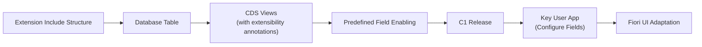

# Key User Field Extensibility

Imagine you're a SaaS provider offering the **Music Festival Manager** to multiple tenants. Each tenant has unique needs: one tenant wants to track the *Venue* of each festival, while another needs a *Genre* field with a fixed set of values like `Rock`, `Jazz`, or `Classical`. As a provider, you want to enable these fields once and let each tenant decide which fields to adopt and how to configure them, all without modifying your source code.

Key user field extensibility makes this possible. It allows you, as a provider, to predefine extension fields on your business object. Tenant administrators (key users) can then configure these fields by setting labels, tooltips, and even code lists, and add them to the SAP Fiori UI at runtime using key user adaptation.

## Overview

Key user field extensibility is a framework in the SAP BTP ABAP environment that enables multi-tenant SaaS applications to offer configurable custom fields to their consumers. It bridges the gap between the provider's application code and tenant-specific customization needs.

The workflow involves two distinct roles:

1. **Provider (Developer in ADT):** Prepares the business object for extensibility by creating an extension include structure, adding extensibility annotations to CDS views, defining a Predefined Field Enabling, and releasing it for key user consumption. Detailed steps are provided in [part 1](#part-1-enabling-predefined-custom-fields-providerdeveloper-in-adt).

2. **Consumer (Key User in SAP Fiori):** Configures the predefined fields in their tenant using the **Configure Predefined Custom Fields** app, then adapts the SAP Fiori UI to display the new fields using key user adaptation. Detailed steps are provided in [part 2](#part-2-configuring-predefined-custom-fields-consumerkey-user-in-sap-fiori) and [part 3](#part-3-adapting-the-sap-fiori-ui-consumerkey-user-in-sap-fiori).

The architecture follows this flow:



After the provider activates the extension, the system automatically generates:
- An append structure on the extension include that contains the actual extension fields
- CDS extension views for both the root entity and projection that expose the fields in the CDS layer

These auto-generated objects require no manual creation.

## Prerequisites

- You've completed [Developing Business Objects](./12-Develop-BTP-ABAP-RAP-Application.md) (Tutorial 12)
- You've completed [Learn about multitenancy](./30-Multi-Tenancy-Build-Deploy-Provision.md) (Tutorial 30)
- You have access to ABAP Development Tools (ADT) for provider/developer steps
- You have access to SAP Fiori launchpad in a consumer tenant for key user steps
- You have the `SAP_BR_EXTENSIBILITY_SPEC` business role assigned that contains the `SAP_CORE_BC_EXT_PCF_PC` catalog for key user steps.

## Part 1: Enabling Predefined Custom Fields (Provider/Developer in ADT)

In this part, you enable the Music Festival business object for key user field extensibility. Perform all steps as the provider or developer using ADT.

> [!NOTE]
> For more information about enabling predefined custom fields, see [Working with Predefined Field Enablings](https://help.sap.com/docs/abap-cloud/abap-development-tools-user-guide/working-with-predefined-field-enablings) on SAP Help Portal.

### Step 1: Create Extension Include Structure

Create an extension include structure that serves as the anchor point for extension fields in the database table.

1. In ADT, right-click the `ZPRA_MF_SERVICE` package and choose **New → Other ABAP Repository Object**.
2. Search for *Structure* and choose **Next**.
3. Enter the following details:
   - **Name:** `ZPRA_MF_A_MF_EXT`
   - **Description:** `Extension include for Music Festival`
4. Choose **Next**, select a transport request, and choose **Finish**.
5. Replace the generated source with the following:

   ```abap
   @EndUserText.label : 'Extension include for Music Festival'
   @AbapCatalog.enhancement.category : #EXTENSIBLE_ANY
   define structure zpra_mf_a_mf_ext {
     dummy : abap.char(1);
   }
   ```

6. Save and activate the structure.

> [!NOTE]
> The `#EXTENSIBLE_ANY` enhancement category allows the system to add append structures to this include. The `dummy` field is a placeholder. The actual extension fields are added automatically by the framework when the Predefined Field Enabling is activated.

### Step 2: Include Extension Structure in Database Table

Add the extension include structure to the Music Festival database table so that extension fields are persisted.

1. In ADT, open the `ZPRA_MF_A_MF` database table.
2. Add the `@AbapCatalog.enhancement.category` annotation to the table definition:

   ```abap
   @AbapCatalog.enhancement.category : #EXTENSIBLE_ANY
   ```

3. Add the following include statement after the existing field definitions:

   ```abap
   include zpra_mf_a_mf_ext;
   ```

4. Save and activate the table.

5. Repeat steps 2–4 for the draft table `ZPRA_MF_D_MF`: open the table in ADT, add the `@AbapCatalog.enhancement.category : #EXTENSIBLE_ANY` annotation, add the `include zpra_mf_a_mf_ext;` statement after the existing field definitions, then save and activate the table.


> [!NOTE]
> The `@AbapCatalog.enhancement.category : #EXTENSIBLE_ANY` annotation marks the table as extensible, allowing the framework to add append structures. The `INCLUDE` directive makes all fields from the extension include (and its append structures) available in the database table.

### Step 3: Add Extensibility Annotations to CDS View Stack

Add the `@AbapCatalog.extensibility` annotation to both the root CDS view entity and the consumption projection. This tells the framework which CDS views participate in extensibility and how they relate to the underlying data source.

#### Root View Entity

1. In ADT, open [`ZPRA_MF_R_MUSICFESTIVAL`](../src/zpra_mf_service/zpra_mf_r_musicfestival.ddls.asddls).
2. Add the following annotation before the `define root view entity` statement:

   ```cds
   @AbapCatalog.extensibility: {
     extensible: true,
     dataSources: ['MusicFestival']
   }
   ```

> [!NOTE]
> The *Data Source Alias* value `'MusicFestival'` must exactly match the alias used in the `as select from` clause. A mismatch causes Predefined Field Enabling activation errors in Step 4. The comparison is case-sensitive.

   ```cds
   define root view entity ZPRA_MF_R_MUSICFESTIVAL
     as select from zpra_mf_a_mf as MusicFestival
   ```

3. Save and activate the view.


> [!NOTE]
> The `@Metadata.allowExtensions: true` annotation should be present from the initial development. This annotation is required in combination with `@AbapCatalog.extensibility` for full extensibility support.

#### Consumption Projection

1. In ADT, open [`ZPRA_MF_C_MUSICFESTIVALTP`](../src/zpra_mf_service/zpra_mf_c_musicfestivaltp.ddls.asddls).
2. Add the following annotation before the `define root view entity` statement:

   ```cds
   @AbapCatalog.extensibility: {
     extensible: true,
     dataSources: ['MusicFestivalBase']
   }
   ```

  > [!NOTE]
  > The alias in the `as projection on` clause must align with the `dataSources` value in the `@AbapCatalog.extensibility` annotation and the Predefined Field Enabling configuration.

3. Save and activate the view.

### Step 4: Create Predefined Field Enabling

The Predefined Field Enabling is the central configuration object that defines which extension fields are available for key users to configure.

1. In ADT, right-click the `ZPRA_MF_SERVICE` package and choose **New → Other ABAP Repository Object**.
2. Search for *Predefined Field Enabling* and choose **Next**.
3. Enter the following details:
   - **Name:** `ZPRA_MF_R_MUSICFESTIVAL`
   - **Description:** `Predefined Fields for Music Festival`
4. Choose **Next**, select a transport request, and choose **Finish**.
5. In the Predefined Field Enabling editor, configure the **Persistence**, **Related View Entities**, and **Predefined Fields** sections as described below.

> [!NOTE]
> The **Predefined Field Enabling** name must match the root CDS view entity name (`ZPRA_MF_R_MUSICFESTIVAL`). This is a technical requirement of the Predefined Field Enabling framework — the **Predefined Field Enabling** references the root entity in its configuration, and matching names ensures correct association between the extensibility definition and the RAP business object.

#### Persistence

| Property              | Value              |
| :-------------------- | :----------------- |
| Database Table        | `ZPRA_MF_A_MF`     |
| Persistence Include   | `ZPRA_MF_A_MF_EXT` |
| Field Prefix          | `ZZPRA_MF_MF_`      |

> [!NOTE]
> The **Field Prefix** defines the namespace constraint for predefined extension field names — every field name in this Predefined Field Enabling must start with the prefix.

#### Related View Entities

Add the following view entities that participate in the extensibility:

| View Entity                     | Data Source Alias    |
| :------------------------------ | :------------------- |
| `ZPRA_MF_R_MUSICFESTIVAL`      | `MusicFestival`      |
| `ZPRA_MF_C_MUSICFESTIVALTP`    | `MusicFestivalBase`  |

> [!NOTE]
> The **Data Source Alias** values must exactly match the aliases used in the CDS view definitions (Step 3). A mismatch causes activation errors.

#### Predefined Fields

Add two character fields:

| Field Name           | Data Type | Length |
| :------------------- | :-------- | :----- |
| `ZZPRA_MF_MF_TEXT1`  | Character | 100    |
| `ZZPRA_MF_MF_TEXT2`  | Character | 100    |

> [!NOTE]
> After activation, the framework automatically generates:
> - An append structure named `ZPRA_MF_A_MF_EXT_EXT` on the extension include containing the two predefined fields
> - CDS extension views `ZPRA_MF_R_MUSICFESTIVAL_EXT` and `ZPRA_MF_C_MUSICFESTIVALTP_EXT` that expose the fields in the CDS layer
>
> You don't need to create these objects manually.
>
> This tutorial uses the `ZZPRA_MF_MF_` prefix. For your own application, use a prefix aligned with the namespace of your development.

6. Save and activate the Predefined Field Enabling.

For reference, the activated Predefined Field Enabling is stored as a JSON object similar to the following. You can view this representation by opening the source view of the Predefined Field Enabling in ADT.

```json
{
  "formatVersion": "1",
  "header": {
    "description": "Predefined Fields for Music Festival",
    "masterLanguage": "EN",
    "abapLanguageVersion": "cloudDevelopment"
  },
  "persistence": {
    "databaseTable": "ZPRA_MF_A_MF",
    "persistenceInclude": "ZPRA_MF_A_MF_EXT",
    "persistenceExtension": "ZPRA_MF_A_MF_EXT_EXT",
    "fieldPrefix": "ZZPRA_MF_MF_"
  },
  "predefinedFields": [
    {
      "name": "ZZPRA_MF_MF_TEXT1",
      "type": "character",
      "length": 100
    },
    {
      "name": "ZZPRA_MF_MF_TEXT2",
      "type": "character",
      "length": 100
    }
  ],
  "relatedViewEntities": [
    {
      "viewEntity": "ZPRA_MF_R_MUSICFESTIVAL",
      "baseObjectAlias": "MUSICFESTIVAL",
      "viewExtension": "ZPRA_MF_R_MUSICFESTIVAL_EXT"
    },
    {
      "viewEntity": "ZPRA_MF_C_MUSICFESTIVALTP",
      "baseObjectAlias": "MUSICFESTIVALBASE",
      "viewExtension": "ZPRA_MF_C_MUSICFESTIVALTP_EXT"
    }
  ],
  "serviceConsumptionModels": []
}
```

> [!NOTE]
> The framework populates the `persistenceExtension` and `viewExtension` properties (the auto-generated append structure and CDS extension views) after activation. You don't enter these values manually. The `baseObjectAlias` values are stored in upper case, even when you enter them as CamelCase in the form-based editor.

### Step 5: Update Behavior Definition

Update the behavior definition to support extension field validation. The framework provides a standard validation class that checks the values of predefined custom fields against their configured rules (length, code list values). To invoke this validation, you need to add a **precheck** on `create` and `update` operations, and a custom **validation** that runs on save.

Make the changes as follows:

1. Add `precheck` to the `create` and `update` operations:

   ```abap
   create ( precheck ) { default function GetDefaultsForCreate; }
   update ( precheck );
   ```
   
2. Add a validation for custom fields:

   ```abap
   validation validateCustomFields on save { create; update; }
   ```

3. Add the `validateCustomFields` validation to the `draft determine action Prepare` block:

   ```abap
   draft determine action Prepare
   {
     ...
     validation validateCustomFields;
   }
   ```

4. Save and activate the behavior definition.

### Step 6: Implement Precheck and Validation for Extension Fields

The `cl_pcf_field_validation` framework class exposes two methods that together cover the full validation surface for predefined custom fields:

- **`precheck_fields`** — *syntax* checks. For example, if a field has a technical length of 100 but a key user configures it with a length of 10, the precheck rejects any longer entry. This runs *before* the change reaches the persistence layer, which is why the `precheck` addition is used on `create` and `update` in the BDEF.
- **`validate_fields`** — *semantic* checks. For example, it verifies that a code list value is one of the configured codes, or that a currency code exists.

Implement both in the behavior implementation class.

1. In ADT, open the `ZBP_PRA_MF_R_MusicFestival` behavior implementation class.
2. In the local handler class definition, add the method declarations for the prechecks (one for `create`, one for `update`) and the validation:

   ```abap
   METHODS precheck_create FOR PRECHECK
     IMPORTING entities FOR CREATE MusicFestival.

   METHODS precheck_update FOR PRECHECK
     IMPORTING entities FOR UPDATE MusicFestival.

   METHODS validateCustomFields FOR VALIDATE ON SAVE
     IMPORTING keys FOR MusicFestival~validateCustomFields.
   ```

3. Implement the precheck methods. Both delegate to `precheck_fields` on the standard validation class:

   ```abap
   METHOD precheck_create.
     cl_pcf_field_validation=>create_instance(
       EXPORTING
         ir_failed   = REF #( failed )
         ir_reported = REF #( reported )
         is_entity   = VALUE #( name  = 'ZPRA_MF_R_MUSICFESTIVAL'
                                alias = 'MusicFestival' )
     )->precheck_fields( REF #( entities ) ).
   ENDMETHOD.

   METHOD precheck_update.
     cl_pcf_field_validation=>create_instance(
       EXPORTING
         ir_failed   = REF #( failed )
         ir_reported = REF #( reported )
         is_entity   = VALUE #( name  = 'ZPRA_MF_R_MUSICFESTIVAL'
                                alias = 'MusicFestival' )
     )->precheck_fields( REF #( entities ) ).
   ENDMETHOD.
   ```

4. Implement the validation method that delegates to `validate_fields`:

   ```abap
   METHOD validateCustomFields.
     cl_pcf_field_validation=>create_instance(
       EXPORTING
         ir_failed   = REF #( failed )
         ir_reported = REF #( reported )
         is_entity   = VALUE #( name  = 'ZPRA_MF_R_MUSICFESTIVAL'
                                alias = 'MusicFestival' )
     )->validate_fields( REF #( keys ) ).
   ENDMETHOD.
   ```

5. Save and activate the class.

> [!NOTE]
> The `cl_pcf_field_validation` class is provided by the framework and encapsulates all logic for predefined custom field checks. The `name` parameter must match the CDS view entity name and the `alias` must match the data source alias used in the `as select from` clause of that view (`MusicFestival` for the root entity).

> [!IMPORTANT]
> Both prechecks and the validation are required. The precheck is invoked on every `create`/`update` request before persistence, rejecting structurally invalid input early. The validation runs `on save`, catching semantic problems such as unknown code list values just before commit. Skipping either leaves a class of invalid data unhandled.

### Step 7: Expose Code List Value Help in Service Definition

Expose the generic code list value help entity in the service definition to enable dropdown support for code list type fields.

1. In ADT, open the `ZPRA_MF_MUSICFESTIVAL` service definition.
2. Add the following line to expose the generic value help:

   ```cds
   expose C_PCF_CodeValueHelp;
   ```

   After the change, the service definition should look similar to this:

   ```cds
   define service ZPRA_MF_MUSICFESTIVAL
     ...
     expose C_PCF_CodeValueHelp;
     ...
   }
   ```

  > [!IMPORTANT]
  > Preserve all existing `expose` statements when adding the new line. Your service definition may already include additional entities such as `ZPRA_MF_AE_REMOTE_PROJ as Project` from [tutorial 40](./40-Integration-with-S4-Public-Cloud.md).

3. Save and activate the service definition.

> [!NOTE]
> `C_PCF_CodeValueHelp` is a standard SAP-provided entity that serves as a generic value help for code list type custom fields. When a key user configures a field with the semantic type *Code List*, the framework automatically links this value help to the field.
>
> If you skip this step, code list fields don't display dropdown values in the UI. The **Genre** field appears as a text input instead of a dropdown with the configured code list values.

### Step 8: Release for C1 Contract

Release the Predefined Field Enabling for the C1 contract to make it available in the key user apps of consumer tenants.

1. In ADT, navigate to package `ZPRA_MF_SERVICE` > **Extensibility > Predefined Field Enabling**, and open `ZPRA_MF_R_MUSICFESTIVAL`.
2. Open the **Properties** view (or right-click → **Properties**).
3. Navigate to the **API State** tab.
4. Set the following:
   - **Release State:** *Released*
   - **Compatibility Contract:** *C1*
   - **Use in Key User Apps:** enabled (checked)
5. Save and activate.

> [!CAUTION]
> Once released with the C1 contract, incompatible changes to the Predefined Field Enabling are restricted. The C1 contract protects consumers from breaking changes. Plan your field definitions carefully before releasing.

> [!NOTE]
> Only Predefined Field Enablings that are released with **Use in Key User Apps** enabled appear in the **Configure Predefined Custom Fields** app in consumer tenants. If this checkbox is not enabled, the fields aren't visible to key users even after transport.

### Step 9: Generate API Snapshot

An API snapshot freezes the released contract of the Predefined Field Enabling at a specific point in time. The snapshot is what compatibility checks compare future changes against, so generating one is mandatory before the Predefined Field Enabling can be transported and consumed by tenants.

For details on creating, viewing, comparing, and removing snapshots, and how subsequent changes are checked against the latest snapshot, see [Manage API Snapshots](https://help.sap.com/docs/sap-btp-abap-environment/abap-environment/manage-api-snapshots) on SAP Help Portal.

> [!IMPORTANT]
> Every time you make a compatible change to the released Predefined Field Enabling (for example, adding a new predefined field), you must generate a new API snapshot. The snapshot history serves as the audit trail for the C1 contract.

### Step 10: Transport Changes to the Multi-Tenant Environment

The objects you have created and changed in Steps 1–9 exist in your development system. To make the predefined custom fields available in consumer tenants, the transport request that holds these objects must be released and imported into the multi-tenant environment.

Follow the transport, build, and deployment process described in [Multitenancy - How to Build, Deploy, and Provision the Application](./30-Multi-Tenancy-Build-Deploy-Provision.md). The same flow applies: release your transport, run the multitenant build, and provision the updated software component to the relevant tenants.

> [!NOTE]
> The **Configure Predefined Custom Fields** app in consumer tenants lists the Music Festival predefined fields released in [Step 8](#step-8-release-for-c1-contract) only after the transport is imported into the multi-tenant landscape. After the import, the framework also generates the append structure `ZPRA_MF_A_MF_EXT_EXT` and the CDS extension views `ZPRA_MF_R_MUSICFESTIVAL_EXT` / `ZPRA_MF_C_MUSICFESTIVALTP_EXT` in the tenant.

## Part 2: Configuring Predefined Custom Fields (Consumer/Key User in SAP Fiori)

In this part, a key user in a consumer tenant configures the predefined fields. All steps are performed in SAP Fiori launchpad.

> [!NOTE]
> For more information about configuring predefined custom fields, see [Configuring Predefined Custom Fields](https://help.sap.com/docs/btp/sap-business-technology-platform/extensibility-configuring-predefined-custom-fields) on SAP Help Portal.

> [!NOTE]
> Ensure the key user has a business role with the `SAP_CORE_BC_EXT_PCF_PC` catalog assigned. This catalog provides access to the **Configure Predefined Custom Fields** app. Without this authorization, the app won't appear on the Launchpad.

### Step 11: Open Configure Predefined Custom Fields App

1. Sign in to the SAP Fiori launchpad of the consumer tenant.
2. Open the **Configure Predefined Custom Fields** app.
3. You can see the Music Festival business object listed with the predefined fields made available by the provider.

> [!NOTE]
> If the Music Festival business object doesn't appear in the **Configure Predefined Custom Fields** app, verify the following:
> 1. The transport was successfully imported into the multi-tenant environment.
> 2. The Predefined Field Enabling is released with **Use in Key User Apps** enabled. 
> 3. An API snapshot was generated in Step 9.

### Step 12: Configure Text Field as "Venue"

Configure the first text field as a free-text field named  **Venue**.

1. In the **Configure Predefined Custom Fields** app, select the Music Festival business object.
2. Select the `ZZPRA_MF_MF_TEXT1` field.
3. Configure the field properties on the **General Information** tab:
   - **Label:** `Venue`
   - **Tooltip:** `Music festival venue or location`
   - **Semantic Type:** *Text*
4. Choose **Create and Publish**.
5. After publishing, select the field again to edit it.
6. Navigate to the **Services** tab.
7. Under **UI Services**, enable the toggle in the **Enabled** column for each service binding.
8. Under **API Services**, enable the toggle in the **Enabled** column for each API service binding if API access is required.
9. Choose **Save** to save the service visibility settings.
10. Choose **Publish** to publish the changes.

> [!NOTE]
> If you change any value during configuration after the initial publication, the field goes into **Revised** state and must be published again. To appear in key user adaptation (part 3), fields must have the **UI Services** toggle enabled. The **API Services** toggle controls programmatic access through OData.

The field is now available as a free-text field labeled **Venue** in the Music Festival Manager application.

### Step 13: Configure Text Field as "Genre" with Code List

Configure the second text field as a **Genre** field with a predefined set of code list values.

1. In the **Configure Predefined Custom Fields** app, select the `ZZPRA_MF_MF_TEXT2` field.
2. Configure the field properties on the **General Information** tab:
   - **Label:** `Genre`
   - **Tooltip:** `Music genre for the festival`
   - **Semantic Type:** *Code List*
3. Choose **Create and Edit** instead of **Create and Publish** to define the code list values.
4. Navigate to the **Code Values** tab.
5. In the code list editor, add the following values:

   | Code Value     |
   | :------------- |
   | `Rock`         |
   | `Jazz`         |
   | `Classical`    |
   | `Electronic`   |
   | `Pop`          |
   | `Hip-Hop`      |
   | `Country`      |
   | `R&B`          |

6. Enable the desired code values using the toggles in the **Enabled** column.
7. Choose **Publish**.
8. After publishing, select the field again to edit it.
9. Navigate to the **Services** tab.
10. Under **UI Services**, enable the toggle in the **Enabled** column for each service binding.
11. Under **API Services**, enable the toggle in the **Enabled** column for each API service binding if API access is required.
12. Choose **Save** to save the service visibility settings.
13. Choose **Publish** to publish the changes.

> [!CAUTION]
> Once published, code list values can't be deleted. You can only enable or disable them. Plan your code list values carefully before publishing.

> [!NOTE]
> The **Code List** semantic type provides a dropdown selection in the UI, unlike the **Text** semantic type that renders as a free-text input. The code list values are served by the `C_PCF_CodeValueHelp` entity exposed in [step 7](#step-7-expose-code-list-value-help-in-service-definition).

## Part 3: Adapting the SAP Fiori UI (Consumer/Key User in SAP Fiori)

In this part, the key user adds the configured custom fields to the SAP Fiori UI using key user adaptation. This is a runtime UI change that applies to all users of the app in the consumer tenant.

> [!NOTE]
> For more information about key user adaptation, see [Adapting SAP Fiori UIs at Runtime (Key User Adaptation)](https://help.sap.com/docs/ui5-flexibility-for-key-users/ui5-flexibility-for-key-users/adapting-sap-fiori-uis-at-runtime-key-user-adaptation) on SAP Help Portal.

### Step 14: Add Custom Fields to the SAP Fiori UI Using Key User Adaptation

1. Open the **Manage Music Festivals** application on SAP Fiori launchpad.
2. Open the user actions menu (your user icon or the three-dot menu in the header).
3. Choose **Adapt UI**. The application enters adaptation mode with a highlighted toolbar.

> [!NOTE]
> If the **Adapt UI** option is not available, verify the key user has a business role with the `SAP_BR_EXTENSIBILITY_SPEC` catalog assigned. Sign out and sign back in after the role assignment so that the authorization can take effect.

#### Add Fields to the List Report

4. On the list report page, right-click the table header and choose **Adapt Filters** from the adaptation toolbar.
5. Add the **Venue** and **Genre** columns to the table.
6. Arrange the columns in the desired order.
7. Choose the **Save** icon  in the **Adapt UI** toolbar to save your changes.
8. Choose the **Activation** icon  in the **Adapt UI** toolbar.
9. In the activation dialog, enter a descriptive tag name (for example, `List Report - Venue and Genre columns`) and confirm the activation.
10. Choose the **Publish** icon   in the **Adapt UI** toolbar to publish the adaptation and make it available to all users in the tenant.

> [!NOTE]
> The activation step creates a versioned snapshot of your adaptation with a meaningful tag. The publish step makes the adaptation active for all users in the consumer tenant.

#### Add Fields to the Object Page

11. Navigate to an existing music festival entry or create a new one to open the object page.
12. In adaptation mode, navigate to the **General Information** section.
13. Choose **Add Field** from the adaptation toolbar.
14. Add the **Venue** and **Genre** fields to the section.
15. Arrange the fields in the desired position.

> [!NOTE]
> If the **Venue** and **Genre** fields don't appear in the Add Field dialog, return to the **Configure Predefined Custom Fields** app. On the Services tab, verify that the applicable services under UI Services are enabled for both fields, and publish any pending changes.

16. Choose the **Save** icon  in the **Adapt UI** toolbar to save your changes.
17. Choose the **Activation** icon  in the **Adapt UI** toolbar.
18. In the activation dialog, enter a descriptive tag name (for example, `Object Page - Venue and Genre fields`) and confirm the activation.
19. Choose the **Publish** icon  in the **Adapt UI** toolbar to publish the adaptation and make it available to all users in the tenant.
20. Exit the adaptation mode by closing the **Adapt UI** toolbar or choose **Exit Adaptation** from the user actions menu.

> [!NOTE]
> Key user adaptations apply to all users of the application in the consumer tenant, not just as personal personalization. The adaptations are stored as UI flexibility changes and persist through application updates, provided the underlying CDS and service structure remains compatible.

### Step 15: Test the End-to-End Flow

1. Close and reopen the **Manage Music Festivals** application. You might have to restart after publishing custom field changes for the first time.
2. Verify that the list report displays the new **Venue** and **Genre** columns.
3. Create a new music festival:
   - Fill in the standard fields (Title, Description, Date, etc.)
   - Enter a value in the **Venue** field (free text, for example, `Madison Square Garden`)
   - Select a value from the **Genre** dropdown (for example, `Rock`)
4. Save the music festival and verify the following:
   - The **Venue** and **Genre** values are displayed on the object page.
   - The **Genre** field shows the dropdown with all configured code list values.
   - The **Venue** and **Genre** values appear in the list report columns.
5. Test validation:
   - Verify that the **Genre** field only accepts values from the configured code list.
   - Verify that the **Venue** field respects the character length constraint of 100 characters.

## Summary

You've successfully implemented key user field extensibility for the Music Festival business object. This tutorial demonstrated how providers can enable predefined custom fields in ADT and how key users can configure and display those fields in their tenant without code changes. This approach allows multi-tenant SaaS applications to adapt to diverse tenant requirements while maintaining a single codebase.

## References

- [Working with Predefined Field Enablings](https://help.sap.com/docs/abap-cloud/abap-development-tools-user-guide/working-with-predefined-field-enablings)
- [Configuring Predefined Custom Fields](https://help.sap.com/docs/btp/sap-business-technology-platform/extensibility-configuring-predefined-custom-fields)
- [Adapting SAP Fiori UIs at Runtime (Key User Adaptation)](https://help.sap.com/docs/ui5-flexibility-for-key-users/ui5-flexibility-for-key-users/adapting-sap-fiori-uis-at-runtime-key-user-adaptation)
- [SAP BTP ABAP Environment — Extensibility](https://help.sap.com/docs/sap-btp-abap-environment/abap-environment/extensibility)
