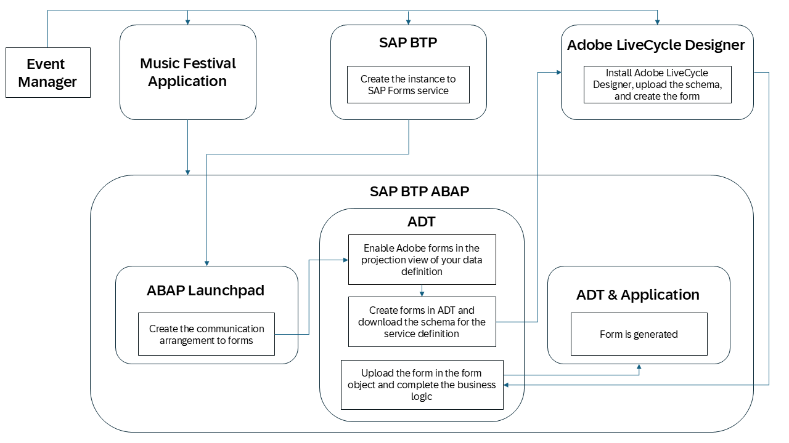
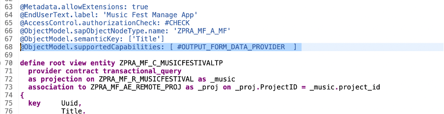
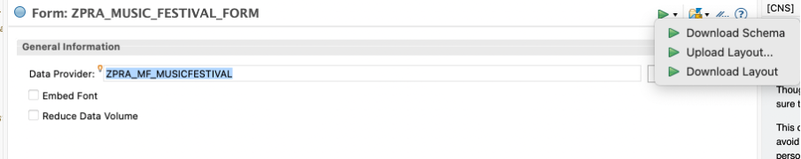
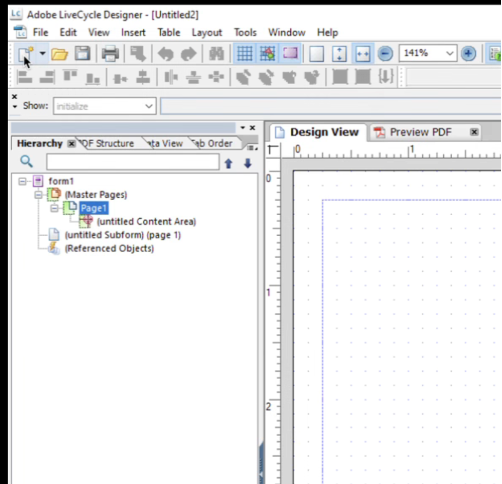
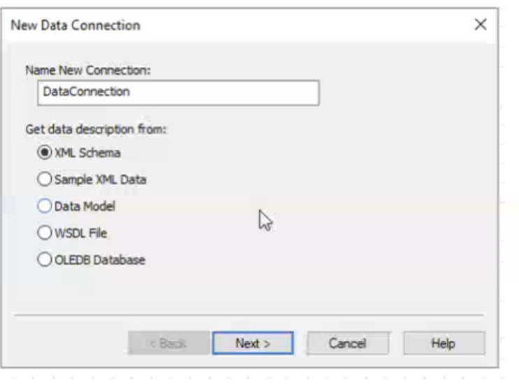
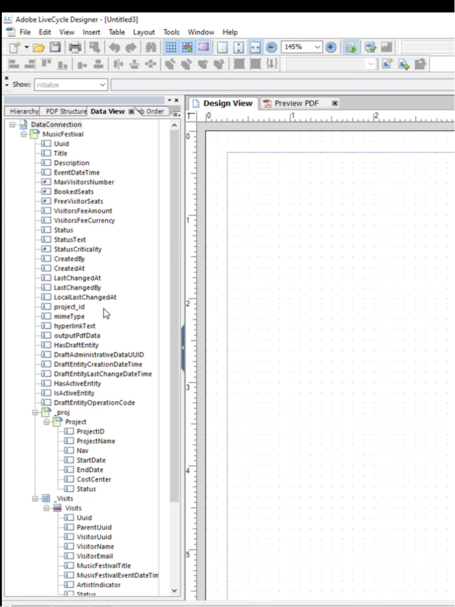
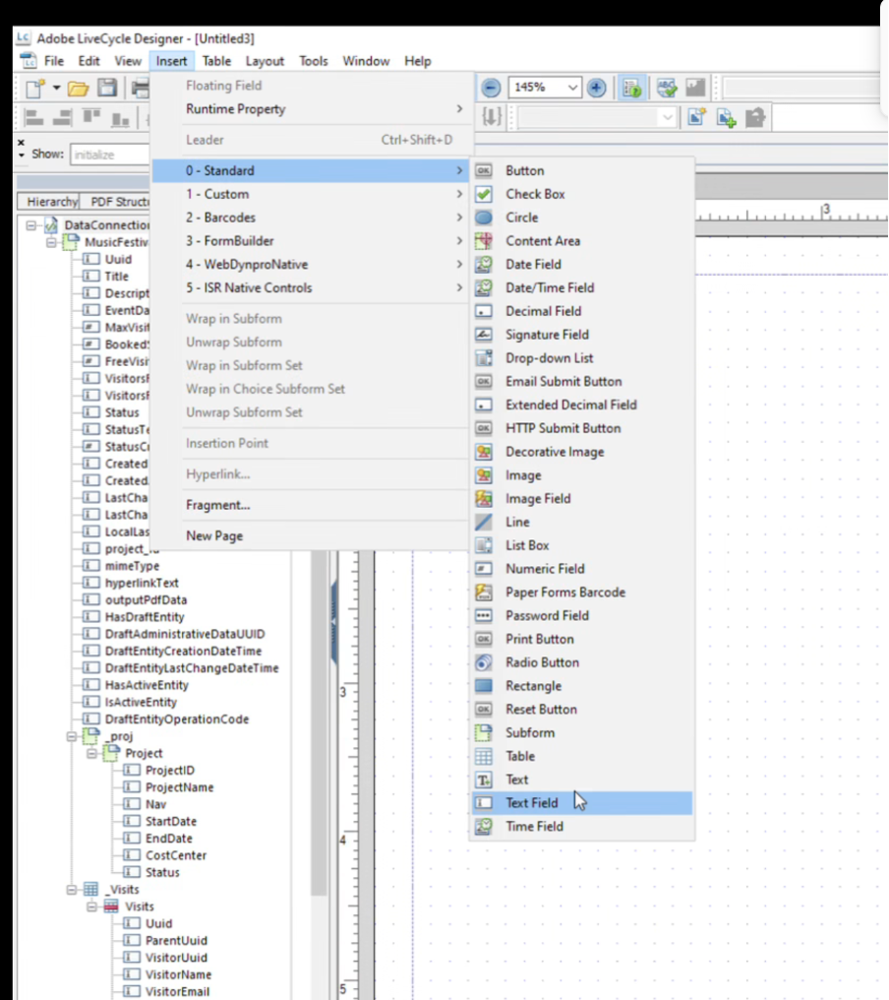
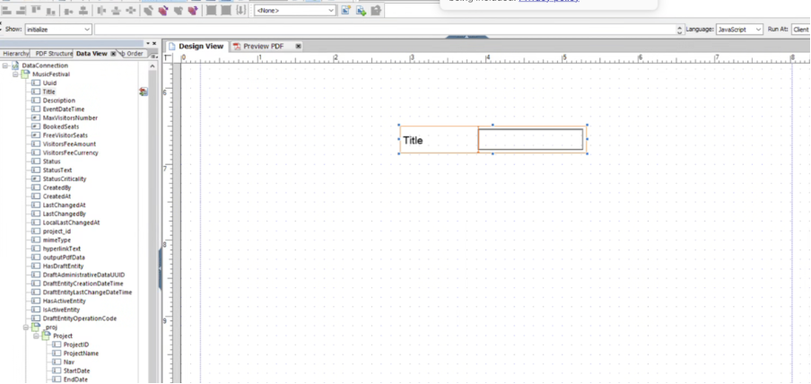
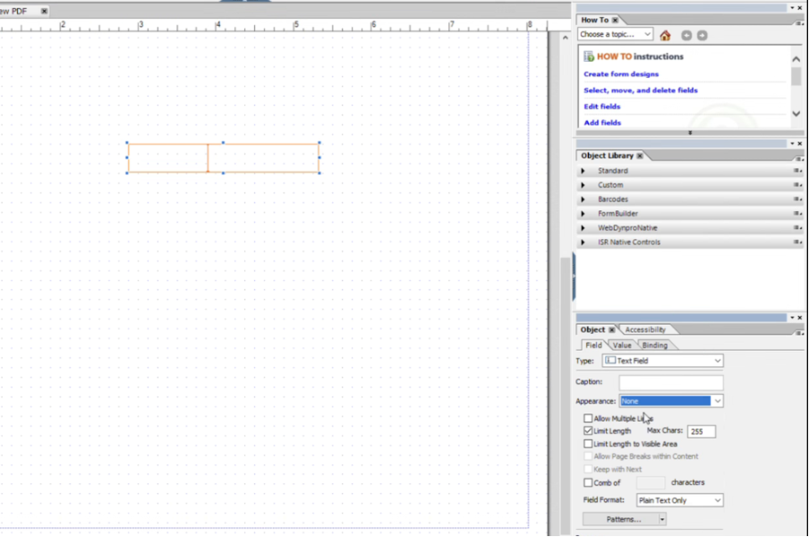

# Creating Forms with Adobe Document Services

Imagine you're a music event manager using a management application to organize events. Visitors attending your events often want all the details in one place: the event schedule, venue, artist, and event fee information.

To simplify this, the application offers a form service. It lets you generate a PDF containing event and visitor details.

This ensures that both you and the visitors have a centralized, well-organized source of truth for the event.

### Overview

  

## Prerequisites for Adobe Forms

1. Install [Adobe LiveCycle Designer](https://help.sap.com/docs/forms-service-by-adobe/sap-forms-service-cf/using-adobe-livecycle-designer?locale=en-US) for the form template creation.
2. Development is done in Adobe LiveCycle Designer.
3. Follow these guidelines to set up the SAP Forms service and communication arrangements in SAP BTP:
   1. [Connecting the SAP Forms Service to ABAP](https://help.sap.com/docs/forms-service-by-adobe/sap-forms-service-cf/connecting-sap-forms-service-to-abap)
   2. [Configure the SAP Forms Service in the ABAP Environment](https://help.sap.com/docs/forms-service-by-adobe/sap-forms-service-cf/configure-sap-forms-service-in-abap-environment)

## Consumption of Adobe Document Services to generate PDF

The Adobe Document Services (ADS) can render Adobe XML Forms (XFA) into PDF documents. The application securely transmits the data and the form template to the service, which then returns the rendered document. This ensures a reliable and efficient process for generating high-quality output.

1. [Retrieving Stored Form Templates](https://help.sap.com/docs/sap-btp-abap-environment/abap-environment/retrieve-stored-form-templates?locale=en-US)
   To utilize stored form templates during runtime, the `CL_FP_FORM_READER` class provides the necessary functionality. This class enables seamless access to uploaded form templates, ensuring that the correct template is used for rendering.

   To read a form template, you can use the `CREATE_FORM_READER` method provided by the `CL_FP_FORM_READER` class. This method facilitates the retrieval of the required form template, making it available for rendering and processing.

   ```abap
   DATA(form_reader) = cl_fp_form_reader=>create_form_reader( 'FORM_NAME' ).
   ```

   To read a form template, you can use the CREATE_FORM_READER method provided by the CL_FP_FORM_READER class. This method facilitates the retrieval of the required form template, making it available for rendering and processing.

2. [Runtime API for ADS Rendering Calls](https://help.sap.com/docs/sap-btp-abap-environment/abap-environment/runtime-api-for-ads-rendering-calls?locale=en-US)

   The `CL_FP_ADS_UTIL` class provides the ABAP Runtime API for making ADS rendering calls. This class offers powerful methods to facilitate the rendering of documents in various formats, ensuring compatibility with different output requirements.

   Key Public Methods
   - `RENDER_PDF`: This method is used to render print-ready PDF documents by combining the XDP form file and the XML data file. It ensures that the generated PDF adheres to the specified layout and data structure, making it suitable for digital distribution, archiving, or further processing.

     ```abap
     cl_fp_ads_util=>render_pdf(
                         EXPORTING
                             iv_xml_data     = " XML data
                             iv_xdp_layout   = " Adobe XDP form template
                             iv_locale       = " Locale for rendering the language: language_COUNTRY, for example en_US
                             is_options      = " PDL rendering parameters (optional)
                         IMPORTING
                             ev_pdf          = " PDF rendering result
                              ).
     ```

   By leveraging these methods, you can efficiently generate high-quality documents tailored to both digital and print-specific requirements.

3. [RAP Data Services](https://help.sap.com/docs/sap-btp-abap-environment/abap-environment/rap-data-services-for-print-forms?locale=en-US)

   The `CL_FP_FDP_SERVICES` class provides the ABAP API to perform the following tasks:
   - _Initiate the Business Data Reader_ to fetch the required business data.

     ```abap
     DATA(fdp_api) = cl_fp_fdp_services=>get_instance( `SERVICE_DEFINITION` ).
     DATA(keys)    = fdp_api->get_keys( ).

     keys[ name = 'UUID' ]-value = 'UUID'.
     ```

   - _Retrieve XML Data from Service Definitions_, ensuring seamless integration with the print form rendering process.

     ```abap
     DATA(data) = fdp_api->read_to_xml_v2( keys ).
     ```

   By leveraging this class, you can streamline the process of obtaining and preparing data for print forms, ensuring accuracy and efficiency in document generation workflows.

## Enhancing the Application Step by Step to Enable Forms

1. To enable the SAP Forms service in the [data definition of the music application](../src/zpra_mf_service/zpra_mf_c_musicfestivaltp.ddls.asddls), you need to add a specific annotation. Locate the file in the **ZPRA_MF_SERVICE** package and include the following annotation: `@ObjectModel.supportedCapabilities: [ #OUTPUT_FORM_DATA_PROVIDER  ]`



2. Create the data element for storing PDF values for the music event in the **ZPRA_MF_SERVICE** package.
   1. Right-click on **Data Elements -> New Data Elements**.
   2. Enter the following details:
      **Name**: ZPRA_MF_FORM
      **Description**: PDF Generation
   3. Choose Next and create a new transport request or save your changes to an existing transport request.
   4. Enter the following data type information:
      **Category**: Predefined Type
      **Data Type**: String
      **Length**: 99000
      **Field Labels**: PDF

3. Create three [virtual elements](../src/zpra_mf_service/zpra_mf_c_musicfestivaltp.ddls.asddls) for consuming forms with a calculation class defined. These virtual elements help determining the mime type and the hyperlink text value of the PDF file to be generated. The **OutputPdfData** assists in calculating the values to display in the form for the music event. The virtual elements are:
   1. Mime:

      ```cds
      ...
      @ObjectModel.virtualElementCalculatedBy: 'ABAP:ZCL_PRA_MF_CALC_MF_ELEMENTS'
      @Semantics.mimeType: true
      virtual mimeType      : abap.char(32)
      ...
      ```

   2. HyperlinkText:

      ```cds
      ...
      @ObjectModel.virtualElementCalculatedBy: 'ABAP:ZCL_PRA_MF_CALC_MF_ELEMENTS'
      @Semantics.mimeType: true
      virtual hyperlinkText : abap.char(16)
      ...
      ```

   3. OutputPdfData:

      ```cds
      ...
      @ObjectModel.virtualElementCalculatedBy: 'ABAP:ZCL_PRA_MF_CALC_MF_ELEMENTS'
      @Semantics.largeObject.contentDispositionPreference: #INLINE
      @Semantics.largeObject.mimeType: 'MimeType'
      @Semantics.largeObject.fileName: 'HyperlinkText'
      virtual OutputPdfData : zpra_mf_om_pdf
      ...
      ```

> [!NOTE]
> Sample form template can be downloaded from [link](./assets/ZPRA_MF_MUSICFESTIVAL.xdp) and proceed towards Steps 8.

> [!CAUTION]
> Make sure the service definition and the CDS view definition names are in CAPITAL letters to consume the form service.

4. Let's create a form now.
   1. Right-click on the package name **ZPRA_MF_SERVICE** and choose **New -> Other ABAP Repository Object**.
   2. Under **Form Objects**, choose **Forms**.
   3. Enter the following information:
      **Name**: ZPRA_MF_PDF_FORM_MF
      **Description**: PDF Form for Music Festival Application
   4. In the created form, under **Data Provider**, choose the **ZPRA_MF_MUSICFESTIVAL** service definition.
   5. Choose **Download Schema** to extract the layout of the form template based on the service definition and save it as **Music_Festival.xdp**.

    

   6. Once the schema is downloaded, you can build the Adobe form template.

5. Open Adobe LiveCycle Designer and choose **New -> Blank -> A4** to create a new form.



6. From the **File** menu, select **New Data Connection**. As **Get data description from**, set **XML Schema**.



7. Upload the schema downloaded in Step 4.6.
8. The music festival structure is now available in Adobe LiveCycle Designer.



9. You can now design the form template.
   1. Choose **Insert -> 0-Standard -> Text Field**.

   

   2. To map the title to the text field you've created, drag the **Title** from the **Data View** tab on the left to the text field.

   

   3. Adjust the properties of the title on the **Objects** tab in the right bottom corner to your needs, for example, appearance, length, etc.

    

   4. You can drag and drop all the required fields from the **Data View** to the form as per customer requirement.
   5. Save the form layout as MusicFestival.xdp.

10. Upload the form layout to the form created in ADT.

    

11. Save and activate the form.
12. Create a util class called [zcl_pra_mf_form_util]() by right-clicking on **Source Code Library** and choosing **New ABAP Class** to process the forms in SAP Forms service. We use the PDF generation service with the **CL_FP_FDP_SERVICES** class.

> [!NOTE]
> The CL_FP_FDP_SERVICES class provides the ABAP API to receive the data in xml format for the use in print forms and the XML Schema Definition (XSD) used for the design of print forms in the Adobe LiveCycle Designer.

13. Let's now define the calculation class defined for the virtual element, for example [ZCL_PRA_MF_CALC_MF_ELEMENTS](../src/zpra_mf_service/zcl_pra_mf_calc_mf_elements.clas.abap), you can add the logic to call the util class you've created. Under the **if_sadl_exit_calc_element_read~calculate** method implementation, add following logic:

    ```abap
    ...
    WHEN 'MIMETYPE'.
        event->MimeType = mc_mime_type.

    WHEN 'HYPERLINKTEXT'.
        event->HyperLinkText = event->Title.

    WHEN 'OUTPUTPDFDATA'.

        IF NEW zcl_pra_mf_com_util(  )->is_scenario_configured( 'SAP_COM_0503' ) EQ abap_true.
        TRY.
            DATA form_util TYPE REF TO zcl_pra_mf_form_util.
            CREATE OBJECT form_util.
            DATA(fp_fdp_service) = form_util->get_fp_fdp_service( 'ZPRA_MF_MUSICFESTIVAL' ).
            event->OutputPdfData = form_util->render_form_for_preview( id             = event->Uuid
                                                                        form_template  = 'ZPRA_MF_PDF_FORM_MF'
                                                                        fp_fdp_service = fp_fdp_service ).
            CATCH cx_fp_fdp_error
                cx_fp_form_reader
                cx_fp_ads_util INTO DATA(exception).

            Raise EXCEPTION type zcx_pra_mf_calc_exit
                EXPORTING
                previous = exception
                textid = zcx_pra_mf_calc_exit=>exception_forms.
        ENDTRY.
        ENDIF.
    ENDCASE.
    ...
    ```

14. For the **OutputPdfData** virtual element, add the UUID to extract the event details in the ** if_sadl_exit_calc_element_read~get_calculation_info** method of the [calculated class](../src/zpra_mf_service/zcl_pra_mf_calc_mf_elements.clas.abap).

    ```abap
    ...
    IF line_exists( it_requested_calc_elements[ table_line = `OUTPUTPDFDATA` ] ).
        INSERT `UUID` INTO TABLE et_requested_orig_elements.
    ENDIF.
    ...
    ```

15. In the [**ZPRA_MF_C_MUSICFESTIVAL_TP**](http://github.com/SAP-samples/abap-partner-reference-application/blob/main/src/zpra_mf_service/zpra_mf_c_musicfestivaltp.ddlx.asddlxs) metadata extension, add the UI changes to include the PDF preview.

    ```abap
    ...
    @UI: {
    lineItem: [{
    importance: #HIGH,
    position: 40
    }]
    }
    OutputPdfData;
    ...
    ```

16. Preview the generated application and view the form.

## A Guided Tour to Explore the Form Feature

Now, take a comprehensive tour through the Forms feature of _Music Festival Manager_ to see how PDF documents are generated for event management:

1. Navigate to the SAP BTP cockpit of the consumer subaccount where the _Music Festival Manager_ application is subscribed.

2. From the cockpit, open the _Music Festival Manager_ application to access the main application.

3. To populate the application with sample data for music festival events, visitors, and visit records, choose `Generate Sample Data`. This action creates a comprehensive list of musical events with realistic test data.

4. In the events list view, locate the `PDF Generation` column. Click on any event name hyperlink within this column to generate and view the PDF form for that specific event.

5. The dynamically generated PDF form opens in a new browser tab, displaying a document.
