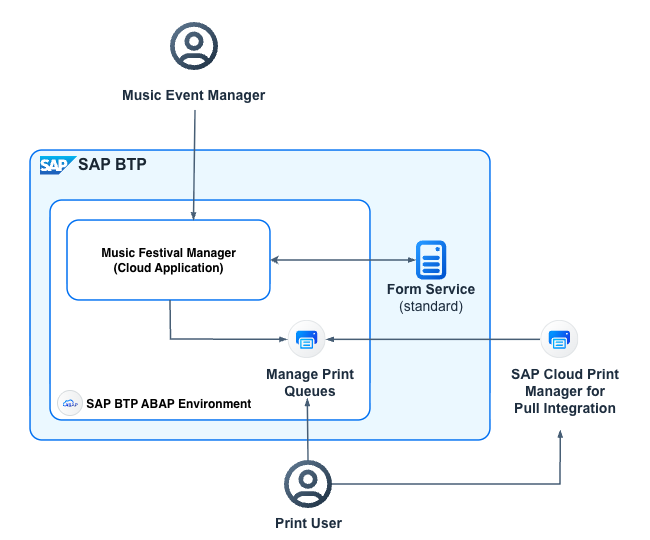

# Print Documents

Imagine you're a music festival manager using a music festival management application to organize and oversee events. Instead of manually creating, viewing, and downloading forms, you want the guest list for an event to be sent directly to a physical printer. Since your printer is located within your customer landscape, a SaaS cloud application like the *Music Festival Manager* cannot directly access the printer.

To enable seamless printing, the SAP BTP ABAP environment provides the [Maintain Print Queues](https://help.sap.com/docs/sap-btp-abap-environment/abap-environment/maintain-print-queues) application. This application allows you to manage print queues effectively. To establish a connection to a local physical printer, you need to link the print queue to the [SAP Cloud Print Manager for Pull Integration](https://help.sap.com/docs/sap-btp-abap-environment/abap-environment/working-with-sap-cloud-print-manager-for-pull-integration). This ensures secure and efficient printing from your cloud application to your local printer.

<p align="center">
    
</p>

## Prerequisites

- Before printing the guest list, ensure that you have completed all the enablement steps described in the [Creating Forms with Adobe Document Services](./41a-Forms-Feature.md) chapter. These steps are essential to set up the necessary configurations and ensure a smooth printing process.
- Follow the configuration steps required to set up the integration between the SAP BTP ABAP environment and local printers using the [SAP_COM_0466](https://help.sap.com/docs/btp/sap-business-technology-platform/sap-com-0466) communication scenario. These steps must be carried out by customers to establish a secure and reliable connection for printing.

## How to Print Forms

The Adobe Document Services (ADS) can render Adobe XML Forms (XFA) into PDF documents and other print-ready formats. The application securely transmits the data and the form template to the service, which then returns the rendered document. This ensures a reliable and efficient process for generating high-quality output.

1. [Retrieving Stored Form Templates](https://help.sap.com/docs/sap-btp-abap-environment/abap-environment/retrieve-stored-form-templates)

    To utilize stored form templates during runtime, the `CL_FP_FORM_READER` class provides the necessary functionality. This class enables seamless access to uploaded form templates, ensuring that the correct template is used for rendering.

    To read a form template, you can use the `CREATE_FORM_READER` method provided by the `CL_FP_FORM_READER` class. This method facilitates the retrieval of the required form template, making it available for rendering and processing.

    ```abap
    DATA(form_reader) = cl_fp_form_reader=>create_form_reader( 'FORM_NAME' ).
    ```

2. [Runtime API for ADS Rendering Calls](https://help.sap.com/docs/sap-btp-abap-environment/abap-environment/runtime-api-for-ads-rendering-calls)

    The `CL_FP_ADS_UTIL` class provides the ABAP Runtime API for making ADS rendering calls. This class offers powerful methods to facilitate the rendering of documents in various formats, ensuring compatibility with different output requirements.

    Key Public Methods

    - `RENDER_PDF`: This method is used to render print-ready PDF documents by combining the XDP form file and the XML data file. It ensures that the generated PDF adheres to the specified layout and data structure, making it suitable for digital distribution, archiving, or further processing.
    - `RENDER_4_PQ`: This method is tailored for rendering documents in the specific print output format required by the target print queue. It communicates with the ADS to produce the output in the appropriate Print Definition Language (PDL) format. The PDL format is automatically derived from the properties of the print queue, ensuring compatibility with the target printer. This method guarantees seamless integration and precise rendering for physical printing workflows.

        ```abap
        cl_fp_ads_util=>render_4_pq(
                            EXPORTING
                                iv_xml_data     = " XML data
                                iv_pq_name      = " Print Queue name
                                iv_xdp_layout   = " Adobe XDP form template
                                iv_locale       = " Locale for rendering the language: language_COUNTRY, for example en_US
                                is_options      = " PDL rendering parameters (optional)
                            IMPORTING
                                ev_pdl          = " PDL (Print Definition Language) rendering result
                                ev_pages        = " Number of pages
                                ev_trace_string = " Trace string).
        ```

    By leveraging these methods, you can efficiently generate high-quality documents tailored to both digital and print-specific requirements.

3. [RAP Data Services for Print Forms](https://help.sap.com/docs/sap-btp-abap-environment/abap-environment/rap-data-services-for-print-forms)

    The XML data required for print form rendering can be obtained from the RAP business services. This ensures that the data is structured and ready for use in generating print forms.

    The `CL_FP_FDP_SERVICES` class provides the ABAP API to perform the following tasks:
    - *Initiate the Business Data Reader* to fetch the required business data.

        ```abap
        DATA(fdp_api) = cl_fp_fdp_services=>get_instance( <SERVICE-DEFINITION-NAME> ).
        DATA(keys)    = fdp_api->get_keys( ).

        keys[ name = 'UUID' ]-value = 'UUID'.
        ```

    - *Retrieve XML Data from Service Definitions*, ensuring seamless integration with the print form rendering process.

        ```abap
        DATA(data) = fdp_api->read_to_xml_v2( keys ).
        ```

    By leveraging this class, you can streamline the process of obtaining and preparing data for print forms, ensuring accuracy and efficiency in document generation workflows.

## How to Add Documents to the Print Queue

The [CL_PRINT_QUEUE_UTILS](https://help.sap.com/docs/sap-btp-abap-environment/abap-environment/printing) class is a standard SAP utility class designed for managing print queue items within the ABAP environment. As part of the cloud-ready ABAP scope, this class provides robust methods to create and manage entries in the output management print queue efficiently.

To add a document to the print queue, you can use the `CREATE_QUEUE_ITEM_BY_DATA` method provided by the `CL_PRINT_QUEUE_UTILS` class. This method allows you to create a print queue item for a specific queue by passing the required data, ensuring seamless integration and management of print jobs in the SAP BTP ABAP environment.

```abap
cl_print_queue_utils=>create_queue_item_by_data(
                                iv_qname            = " Name of the print queue
                                iv_print_data       = " Print document contained in xstring format
                                iv_name_of_main_doc = " Name of the main document
                                iv_number_of_copies = " Number of copies
                                iv_pages            = " Number of pages
                                it_attachment_data  = " List of attachments within the structure.
                              ).
```

## Enhancing the Application Step by Step to Print Documents

1. To enable a value help for selecting print queues, you need to create a custom entity named [`ZPRA_MF_CE_PRINTQUEUE_VH`](../src/zpra_mf_service/zpra_mf_ce_printqueue_vh.ddls.asddls). This entity serves as the foundation for the value help functionality. To populate data for this value help, implement the logic in an associated implementation class named [`ZCL_PRA_MF_PRINTQUEUE_VH`](../src/zpra_mf_service/zcl_pra_mf_printqueue_vh.clas.abap). This class handles the retrieval and processing of print queue data.

> [!NOTE]
> Activating `ZPRA_MF_CE_PRINTQUEUE_VH` and `ZCL_PRA_MF_PRINTQUEUE_VH` requires special handling due to a circular dependency, as both objects reference each other. To resolve this, follow the steps below carefully:
> 1. Temporarily comment out the annotation `@ObjectModel.query.implementedBy: 'ABAP:ZCL_PRA_MF_PRINTQUEUE_VH'` in the *ZPRA_MF_CE_PRINTQUEUE_VH* object and activate it.
> 2. Proceed to activate the *ZCL_PRA_MF_PRINTQUEUE_VH* object.
> 3. Once the activation of *ZCL_PRA_MF_PRINTQUEUE_VH* is successful, uncomment the annotation `@ObjectModel.query.implementedBy: 'ABAP:ZCL_PRA_MF_PRINTQUEUE_VH'` in the *ZPRA_MF_CE_PRINTQUEUE_VH* object and activate it again.
>
> This process ensures that the circular dependency is resolved without errors during activation.

2. To define an action with an input parameter, you need to create an abstract entity view called [`ZPRA_MF_AE_PRINTGUESTLIST`](../src/zpra_mf_service/zpra_mf_ae_printguestlist.ddls.asddls). This abstract entity view acts as the blueprint for the action, allowing you to pass input parameters and execute specific operations related to printing guest lists.

3. Create an action called **printGuestList** on the music festival object page to enable printing of the guest list. This involves defining the action in the [`ZPRA_MF_R_MUSICFESTIVAL`](../src/zpra_mf_service/zpra_mf_r_musicfestival.bdef.asbdef) behavior definition file, using in the behavior definition projection `ZBP_PRA_MF_C_MUSICFESTTP` and implementing the logic in the corresponding [`ZBP_PRA_MF_R_MUSICFESTIVAL`](../src/zpra_mf_service/zbp_pra_mf_r_musicfestival.clas.locals_imp.abap) implementation class. The action triggers a popup that allows users to select a print queue. All print queues configured in the **Maintain Print Queues** application are displayed in the value help list, ensuring seamless selection.

4. Enhance the [`ZPRA_MF_R_MUSICFESTIVAL`](../src/zpra_mf_service/zpra_mf_r_musicfestival.bdef.asbdef) behavior definition to [Integrating Additional Save in Managed Business Objects](https://help.sap.com/docs/abap-cloud/abap-rap/integrating-additional-save-in-managed-business-objects). Create a new local class named `lsc_zpra_mf_r_musicfestival` to encapsulate the implementation of this logic in the corresponding [`ZBP_PRA_MF_R_MUSICFESTIVAL`](../src/zpra_mf_service/zbp_pra_mf_r_musicfestival.clas.locals_imp.abap) implementation class.

5. To integrate the action into the SAP Fiori UI, add a reference to the `printGuestList` action on the object page in the metadata extension file named [`ZPRA_MF_C_MUSICFESTIVALTP`](../src/zpra_mf_service/zpra_mf_c_musicfestivaltp.ddlx.asddlxs). This ensures that the action button is visible and accessible to users, providing a streamlined experience for printing guest lists directly from the object page.

6. To enable rendering of documents in a specific print output format, enhance the [`ZIF_PRA_MF_FORM_UTIL`](../src/zpra_mf_service/zif_pra_mf_form_util.intf.abap) interface and the [`ZCL_PRA_MF_FORM_UTIL`](../src/zpra_mf_service/zcl_pra_mf_form_util.clas.abap) utility class by introducing a new method named `RENDER_FORM_FOR_PRINT_QUEUE`.

7. Document printing is typically managed through background processing, utilizing the [*Background Processing Framework*](https://help.sap.com/docs/abap-cloud/abap-concepts/background-processing-framework) to ensure optimal system performance and transactional reliability.

    - To further streamline and centralize the handling of print operations, develop a utility class called [`ZCL_PRA_MF_BGMC_OP_PRINT_UTIL`](../src/zpra_mf_service/zcl_pra_mf_bgmc_op_print_util.clas.abap). This class is responsible for managing all aspects of the print job lifecycle, including initiation, execution, and monitoring. By encapsulating the logic within this utility class, you ensure a modular, reusable, and maintainable design that simplifies the integration of print operations into the overall application workflow.

8. To manage background processing tasks effectively, update the [`ZBP_PRA_MF_R_MUSICFESTIVAL`](../src/zpra_mf_service/zbp_pra_mf_r_musicfestival.clas.abap) class to include logic for handling processes. Specifically, add entries to the `bgmc_processes` table, which should be defined as a table of type `if_bgmc_process`.

9. The `bgmc_processes` variable is a private attribute of the [`ZBP_PRA_MF_R_MUSICFESTIVAL`](../src/zpra_mf_service/zbp_pra_mf_r_musicfestival.clas.abap) behavior definition class. To enable access from the [`LHC_ZPRA_MF_R_MUSICFESTIVAL`](../src/zpra_mf_service/zbp_pra_mf_r_musicfestival.clas.locals_imp.abap) behavior definition implementation class, you need to use the *friend* declaration or leverage *protected visibility* to allow controlled access. This ensures that the private variable can be accessed while maintaining encapsulation and adhering to Clean ABAP principles.

10. Next, you need to implement the action logic in the behavior definition class called [`ZBP_PRA_MF_R_MUSICFESTIVAL`](../src/zpra_mf_service/zbp_pra_mf_r_musicfestival.clas.locals_imp.abap) to call the [`ZCL_PRA_MF_BGMC_OP_PRINT_UTIL`](../src/zpra_mf_service/zcl_pra_mf_bgmc_op_print_util.clas.abap) utility class.

> [!NOTE]
> Enhance the [`ZCM_PRA_MF_MESSAGES`](../src/zpra_mf_service/zcm_pra_mf_messages.clas.abap) class to include new error messages: `error_bgpf_process_creation` and `error_bgpf_process_execution`. These messages should be added to handle specific error scenarios during the creation and execution of background processes for print.

11. The execution of background processing is handled within the additional save context of RAP. In the `save_modified` method of the [`ZBP_PRA_MF_R_MUSICFESTIVAL`](../src/zpra_mf_service/zbp_pra_mf_r_musicfestival.clas.locals_imp.abap) class, the background job execution is triggered. This ensures that the background processing tasks are initiated only after the transactional changes are successfully persisted, maintaining data consistency and adhering to the RAP lifecycle.

> [!NOTE]
> The `CREATE_QUEUE_ITEM_BY_DATA` method of the `CL_PRINT_QUEUE_UTILS` class performs a `COMMIT WORK`, which is not permitted during the interaction phase of RAP. To ensure compliance with RAP's transactional model, this method must be invoked during the save phase. This guarantees that the commit operation aligns with the RAP lifecycle, maintaining data consistency and transactional integrity.

## A Guided Tour to Explore the Print Feature

Take a tour through the print feature of the *Music Festival Manager*:

1. Open the SAP BTP cockpit of the customer subaccount.

2. Open the Music Festival application of the Music Festival Manager.

3. To create sample data for mutable data, such as music festival events, visitors, and visits, choose *Generate Sample Data*. As a result, a list with several musical events is shown.

4. Open a music festival event and choose *Print Guest List* in the menu of the object page. On the popup, select a print queue and choose *Print Guest List*. 

>[!TIP]
> If no print queue is available from the drop-down list box, go to the [Maintain Print Queues](https://help.sap.com/docs/sap-btp-abap-environment/abap-environment/maintain-print-queues) application and maintain a print queue as described there.

5. When you open the print queue from the *Maintain Print Queues* application, you can find the document.

6. You can install the [*SAP Cloud Print Manager for Pull Integration*](https://help.sap.com/docs/sap-btp-abap-environment/abap-environment/working-with-sap-cloud-print-manager-for-pull-integration) on your Windows server to regularly pull documents from print queues and send them to a local printer.
