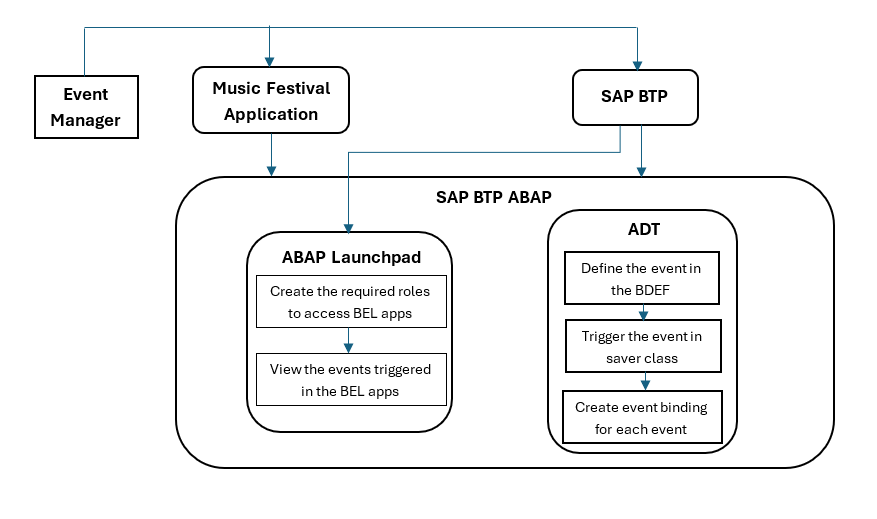
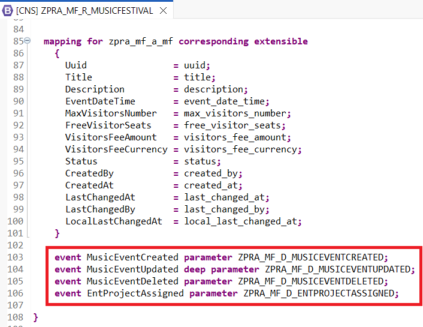
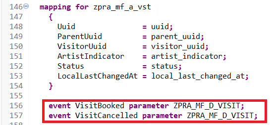
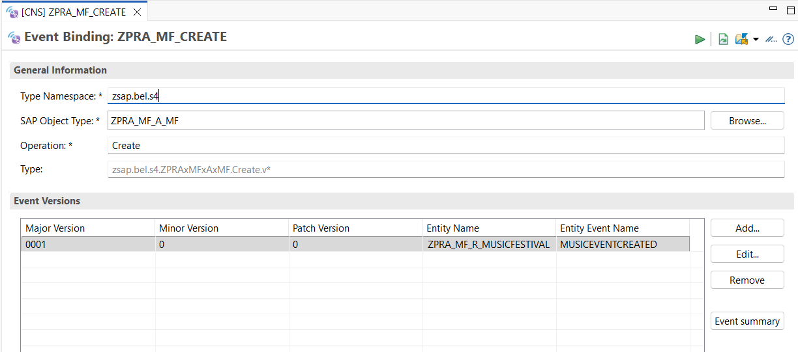
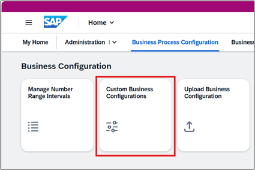
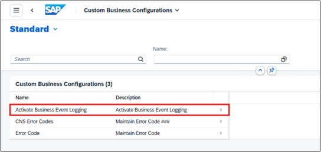
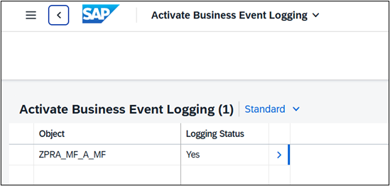
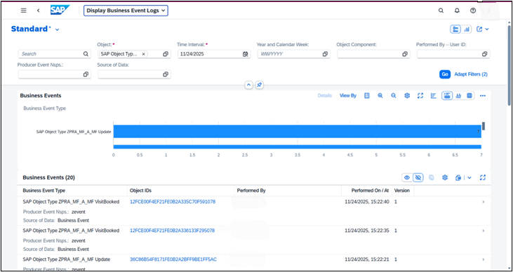
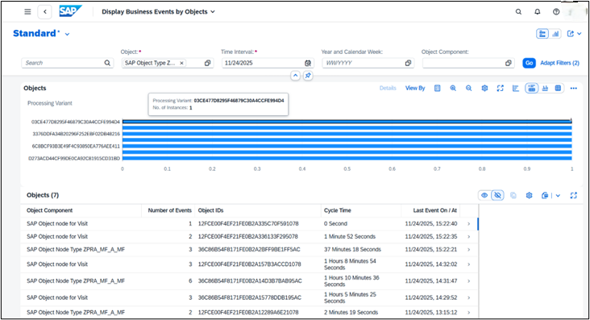
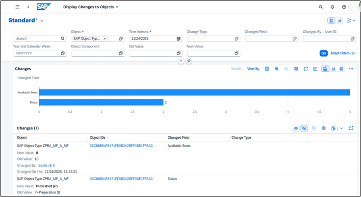

# Triggering Events and monitoring it in Business Event Logging (BEL).

## Overview

In this tutorial, you learn how to trigger events for various scenarios, such as creating, updating, or deleting a musical event in partner reference applications developed using **ABAP RESTful Application Programming** (RAP). Events most commonly refer to business events emitted by a RAP business object to signal that something meaningful happened. For example, an order was approved, or a music festival event was created, updated, or deleted. Once the events are triggered, you can monitor them in **Business Event Logging** (BEL).

Proceed with the following steps to trigger RAP business events in the Partner Reference Applications and verify them in BEL:
1.	Create an abstract entity
2.	Define an event
3.	Trigger an event
4.	Create event bindings
5.	Monitor events in BEL
For more information about how to define and raise an entity in RAP BO, see [Business Events](https://help.sap.com/docs/abap-cloud/abap-rap/concept-business-events).



## Create an Abstract Entity with the Fields Required in the Event Payload

Each event contains information in its payload. A parameter is assigned to each event to define the payload format. The payload is modeled using an abstract entity.
1.	On *ABAP Development Tools for Eclipse*, right-click on **ZPRA_MF_SERVICE → New → Other ABAP Repository Object** and create a new abstract entity.
2.	Create an abstract entity for each event:
    - ZPRA_MF_D_MUSICEVENTCREATED for **MusicEventCreated** event.
    - ZPRA_MF_D_MUSICEVENTDELETED for **MusicEventDeleted** event.
    - ZPRA_MF_D_ENTPROJECTASSIGNED for **EntProjectAssigned** event.
    - ZPRA_MF_D_VISIT for **VisitBooked** and **VisitCancelled** event.
3.	Specify the fields in the abstract entity that must be included in the event payload, along with their required data types.

    [ZPRA_MF_D_MUSICEVENTCREATED](../src/zpra_mf_service/zpra_mf_d_musiceventcreated.ddls.asddls)

    The following fields are part of each event. The data elements were created in the previous release and reused in the abstract entity.

    | Event Name                       | Event Attribute Name | Data Element |
    | -------------------------------- | -------------------- | ------------ |
    | Music Event Created              | Title                | ZPRA_MF_TITLE |
    |                                  | EventDateTime        | ZPRA_MF_DATE_TIME |
    |                                  | Status               | ZPRA_MF_MUSIC_FEST_STATUS_CODE |
    | Music Event Deleted              | Title                | ZPRA_MF_TITLE |
    | Enterprise Project Assigned      | Title                | ZPRA_MF_TITLE |
    |                                  | EventDateTime        | ZPRA_MF_DATE_TIME |
    |                                  | Project Id           | ABAP.CHAR(24) |
    | Visit Booked and Visit Cancelled | ParentUuid           | SYSUUID_X16 |
    |                                  | VisitorUuid          | SYSUUID_X16 |
    |                                  | Name                 | ZPRA_MF_NAME |
    | Music Event Updated              | Title                | ZPRA_MF_TITLE |
    |                                  | Status               | ZPRA_MF_MUSIC_FEST_STATUS_CODE |
    |                                  | MaxVisitorsNumber    | ZPRA_MF_FREE_VISITOR_SEATS |
    |                                  | VisitorsFeeAmount    | ZPRA_MF_PRICE |
    |                                  | VisitorsFeeCurrency  | ZPRA_MF_CURRENCY_CODE |
    |                                  | EventDateTime        | ZPRA_MF_DATE_TIME |
    |                                  | ArtistName           | ZPRA_MF_NAME |

4. To define field changes in a business event such as **MusicEventUpdated**, create an abstract entity with a nested structure that shows the before and new values.
5. Create an abstract entity named **ZPRA_MF_D_MUSICEVENTUPDATED** with the required fields and a node named `__before` (two underscores). The node is a composition of ZPRA_MF_D_MUSICEVENTUPDATED_OLD. Don't activate the entity.

    [ZPRA_MF_D_MUSICEVENTUPDATED](../src/zpra_mf_service/zpra_mf_d_musiceventupdated.ddls.asddls)

6. Create an abstract entity named **ZPRA_MF_D_MUSICEVENTUPDATED_OLD** with the same fields as **ZPRA_MF_D_MUSICEVENTUPDATED** and a node named as `_parent` with an association to the parent **ZPRA_MF_D_MUSICEVENTUPDATED**.

    [ZPRA_MF_D_MUSICEVENTUPDATED_OLD](../src/zpra_mf_service/zpra_mf_d_musiceventupdtd_old.ddls.asddls)

7. Create an abstract behavior definition named **ZPRA_MF_D_MUSICEVENTUPDATED** with the behaviors for **ZPRA_MF_D_MUSICEVENTUPDATED** and **ZPRA_MF_D_MUSICEVENTUPDATED_OLD** as shown below.

    [ZPRA_MF_D_MUSICEVENTUPDATED](../src/zpra_mf_service/zpra_mf_d_musiceventupdated.bdef.asbdef)

8. Activate all the objects together.

> [!NOTE]
> For the Music Update Event, assume that only one artist is present for the Music Fest. The system always picks the first artist. To handle scenarios with multiple artists, you need to make changes accordingly.

## Define an Event

1. In ABAP Development Tools for Eclipse, call up the behavior definition of the services.
2. Define the event with the key word `EVENT` in the respective entity, with the parameter as the abstract entity. https://github.com/SAP-samples/abap-partner-reference-application/blob/f230ffcea14241acde009cd49e17578ca01d0734/src/zpra_mf_service/zpra_mf_r_musicfestival.bdef.asbdef#L103

    
    
3. Event definitions for child entities must be placed in the child behavior definition. https://github.com/SAP-samples/abap-partner-reference-application/blob/f230ffcea14241acde009cd49e17578ca01d0734/src/zpra_mf_service/zpra_mf_r_musicfestival.bdef.asbdef#L156

    

## Trigger an Event from the RAP BO

Events must be triggered once the point of no return has passed and the business process is complete, which is why the event is raised with an additional save in the late save phase. This ensures that the data is saved to the database, and the state change of the BO is final.

1. Define the **additional save** for the BO entity for which the event must be raised.
    - In the BDEF, add `managed with additional save implementation in class <class name> unique` as the first line to define additional save.
    - In the `Local Types` of the class, declare a local class. Refer to the example below.
    ```
    CLASS <class name> DEFINITION INHERITING FROM cl_abap_behavior_saver.
        PROTECTED SECTION.
        METHODS save_modified REDEFINITION.
    ENDCLASS.

    CLASS lsc_zpra_mf_r_musicfestival IMPLEMENTATION.
        METHOD save_modified.
        ENDMETHOD.
    ENDCLASS.
    ```
2. Raise the event in the `save_modified` method of the local class declared above with the keyword `RAISE ENTITY EVENT`.

    [ZBP_PRA_MF_R_MUSICFESTIVAL](../src/zpra_mf_service/zbp_pra_mf_r_musicfestival.clas.locals_imp.abap)

3. In the `save_modified` method, you can check whether the `create`, `update`, and `delete` variables are initial to determine if any changes were made. Based on this check, call `RAISE ENTITY EVENT` to trigger the event. When you call `RAISE ENTITY EVENT`, provide the instance key and the parameter values for the event. The following example shows how to raise the event for the creation of a music festival:
```
IF create-musicfestival IS NOT INITIAL.
    RAISE ENTITY EVENT zpra_mf_r_musicfestival~MusicEventCreated
     FROM VALUE #( ( %key   = CORRESPONDING #( create-musicfestival[ 1 ] )
                     %param = CORRESPONDING #( create-musicfestival[ 1 ] )
     ) ).
ENDIF.
```

## Creating Event Bindings

You must enable event binding to map relevant information and send an event to the SAP event infrastructure.

If the event consumer isn't in the same system as the event provider (remote consumption), you must create an event binding. In the binding, include the RAP BO interface with the exposed event. The event binding represents the design time definition of the event and maps the event defined in a RAP BO to a namespace, a business object, and a business object operation, such as modify.

1. In ABAP Development Tools for Eclipse, right-click **ZPRA_MF_SERVICE → New → Other ABAP Repository Object** and create a new event binding object named **ZPRA_MF_CREATE**.
2. In the creation wizard, provide the values as follows:
    - *Type Namespace* - This can be any value, for example *zsap.bel.s4*. 
    - *SAP Object Type* - Name of the SAP Object Type, 
    - *Operation* - This can be `create`, `update`, `delete` etc.
3. In the Event Versions, add a new entry and provide the *Entity Name* and *Entity Event Name*.

    

4. Similarly, create the following event Bindings for the rest of the events:
    - ZPRA_MF_DELETE.
    - ZPRA_MF_ENTPROJ_ASSIGN.
    - ZPRA_MF_UPDATE.
    - ZPRA_MF_VISIT_BOOKED.
    - ZPRA_MF_VISIT_CANCELLED.

## Monitor Events in BEL

You can use BEL after you complete a simple configuration. For more information, see the blog post [Step by Step Implementation of Customer-Defined Events in Business Event Logging](https://community.sap.com/t5/technology-blog-posts-by-sap/step-by-step-implementation-of-customer-defined-events-in-business-event/ba-p/14056091).

1. Ensure you have the following roles:
    > [!NOTE]
    > Creating business roles and assigning business users is already explained in [this tutorial](22-Integration%20Application%20into%20Launchpad.md).
    - Create a custom role using the **SAP_BR_BPC_EXPERT** template to configure Business Event Logging.
    - Create another custom role using the **SAP_BR_BUSINESS_PROCESS_SPEC** template to check the event log.
2. To monitor all configured custom business events using BEL, maintain the SAP Object Type (SOT) by following the steps below.
    - In the home screen, choose the **Custom Business Configurations** app under the **Business Process Configuration** tab.

     


    - Choose **Activate Business Event Logging**.

    


    - Set the **SAP Object Type** and the **Logging Status** to *Yes*.

    

3. In BEL, there are three apps that can be used to monitor the events.
    - **Display Business Event Logs** – Displays all the events for the configured objects.

    


    - **Display Business Events by Objects** – The events are grouped based on each object node.

    


    - **Display Changes to Objects** – Displays the changes done to each object.

    

## A Guided Tour to Explore the BEL Feature

Take a comprehensive tour through the BEL feature of **Music Festival Manager** to see how you can trigger and monitor events in BEL applications.

1. Navigate to the SAP BTP cockpit of the consumer subaccount where the **Music Festival Manager** application is subscribed.
2. From the cockpit, open the **Music Festival Manager** application to access the main application.
3. To populate the application with sample data for music festival events, visitors, and visit records, choose **Generate Sample Data**. This action creates a comprehensive list of musical events with realistic test data.
4. Select the main application **Manage Music Festivals** and then create, update, or delete a music festival event or book visits for a music festival event to trigger the corresponding events.
5. From the cockpit, open the **Business Process Management** application to view the BEL apps after assigning the required roles.
6. Open each app and then filter the entries based on the mandatory fields `Object` and `Time Interval`. Choose **Go** to view the relevant entires.
