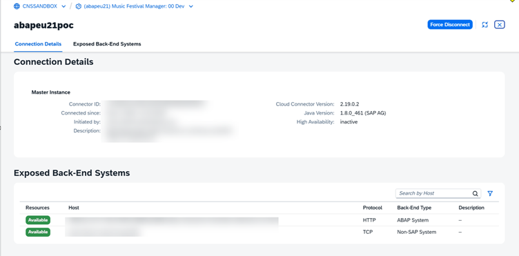
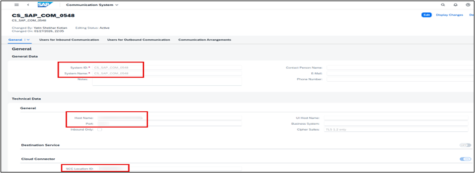
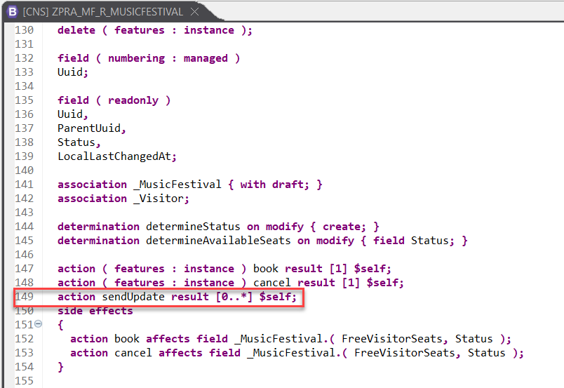
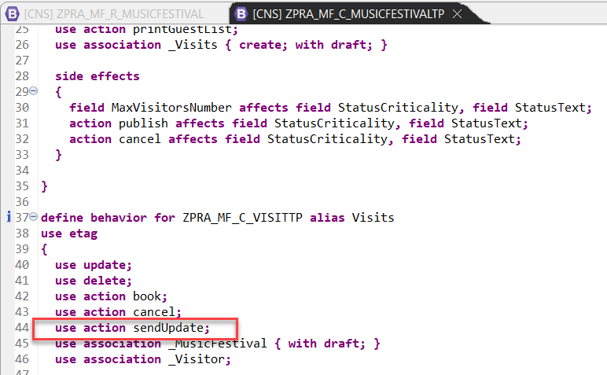
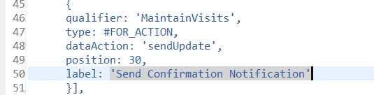
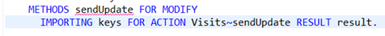
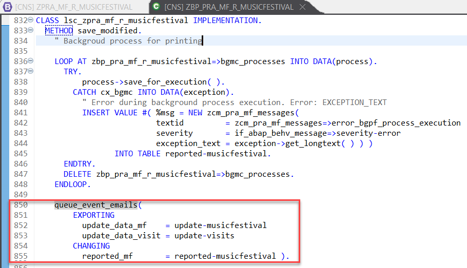

# Email Functionality in Music Festival Manager ABAP PRA SBS Application

## Overview

In this tutorial, you learn how to set up and implement email notification functionality in the ABAP Partner Reference Application. 

Consider two common scenarios:

As a visitor, manually checking the application for updates to a music festival you've registered for is inconvenient. Automated email notifications are more practical. 

As a festival manager, contacting each participant individually whenever something changes is time-consuming. A single action that notifies all registered visitors at once is significantly more efficient.

By the end of this tutorial, you'll have implemented both: automated notifications that trigger when key festival details change, and an on-demand notification action that lets managers alert participants with a single click. 

## Functional Scope
**Manual Trigger**: Ability to select a set of participants from the *Music Festival* and choose *Send Confirmation Notification*. 

**Automated Trigger**: Notifications must be sent automatically when: 

1. A new visitor is added with status **Booked** or **Cancelled**.  
2. The date of the event is changed. 
3. The number of maximum participants count is updated. 
4. A linked Enterprise Project is successfully created in SAP S/4HANA Cloud Public Edition.

## Prerequisites 
Before starting this tutorial, complete the following setup steps. 
1. Cloud Connector Configuration 

    Ensure the following:
    -   SMTP server is available and accessible
    -   [Cloud Connector (SCC)](https://help.sap.com/docs/btp/sap-business-technology-platform/integrating-outbound-emails-using-smtp) is configured for the SMTP server
    -   SCC is assigned to the respective SAP BTP subaccount as mentioned in [Adding and Managing Subaccounts
    ](https://help.sap.com/docs/connectivity/sap-btp-connectivity-cf/managing-subaccounts)

    The Cloud Connector entry should appear as follows in the SAP BTP cockpit:

    

2. SMTP Outbound User
    Create an SMTP authentication account to be used as the outbound user in the communication arrangement.

3. Set up the Communication Arrangement
    i. Create a new [communication arrangement](https://help.sap.com/docs/btp/sap-business-technology-platform/how-to-create-communication-arrangement) based on the scenario named *SAP_COM_0548*. 

    ii. Create a new [communication system](https://help.sap.com/docs/btp/sap-business-technology-platform/how-to-create-communication-systems) in the communication arrangement. 

    

    iii. Maintain the user for outbound communication for SMTP access.

    The resulting communication arrangement should look as follows:

    

## Implementation Logic

1. Create the BGMC email operation class - **ZCL_PRA_MF_BGMC_OP_EMAIL_UTIL**.

This class is the core of the feature. It represents a single unit of background work: constructing and sending one personalized HTML email to one visitor.
The class implements *IF_BGMC_OP_SINGLE_TX_UNCONTR*, which means the BGMC framework executes it asynchronously in the background and manages the database transaction. Your code does not issue *COMMIT WORK* or *ROLLBACK WORK*. If the SMTP call fails, the class re-raises the error as *CX_BGMC_OPERATION* with *do_retry = abap_true*, instructing the framework to automatically retry after five seconds.
All data the class needs (visitor name, email address, subject, and message body) is passed through the constructor and stored as instance attributes. This is required because BGMC serializes the operation object during the RAP save phase and deserializes it before background execution. The data must be present on the object itself before execute is called.

Class Declaration 

```abap
CLASS zcl_pra_mf_bgmc_op_email_util DEFINITION
  PUBLIC FINAL
  CREATE PUBLIC.

  PUBLIC SECTION.
    TYPES: BEGIN OF email_request_structure,
             visitor_name  TYPE zpra_mf_name,
             email_address TYPE c LENGTH 512,
             subject       TYPE c LENGTH 1024,
             message_body  TYPE c LENGTH 1000,
           END OF email_request_structure.

    INTERFACES if_bgmc_op_single_tx_uncontr.

    METHODS constructor
      IMPORTING email_input_data TYPE email_request_structure.

  PRIVATE SECTION.
    DATA email_request TYPE email_request_structure.
ENDCLASS.
```
Class Implementation
```abap
CLASS zcl_pra_mf_bgmc_op_email_util IMPLEMENTATION.
  METHOD constructor.
    email_request = email_input_data.
  ENDMETHOD.

  METHOD if_bgmc_op_single_tx_uncontr~execute.
    TRY.
        DATA(mail_message) = cl_bcs_mail_message=>create_instance( ).

        " Sender – fixed no-reply address for all notification emails
        mail_message->set_sender( 'noreply+abapprasbs@sap.corp' ).

        " Subject – direct char assignment, no conversion needed
        mail_message->set_subject( email_request-subject ).

        " Recipient – direct char assignment, no conversion needed
        mail_message->add_recipient(
            iv_address = email_request-email_address ).

        " HTML body – build personalised content, attach via cl_bcs_mail_textpart
        DATA(html_body) = |<h2>Dear { email_request-visitor_name },</h2><p>{ email_request-message_body }</p>|.
        mail_message->set_main(
            cl_bcs_mail_textpart=>create_text_html( html_body ) ).

        " Send and capture delivery status
        TEST-SEAM send_mail.  "#EC CI_TEST_SEAM_USAGE
          DATA(status_monitor) = mail_message->send( ).
          status_monitor->get_email_status(
              IMPORTING
                es_mail_status         = DATA(mail_status)
                et_recipients_statuses = DATA(recipients_statuses) ).
        END-TEST-SEAM.

      CATCH cx_bcs_mail INTO DATA(mail_exception).
        " Re-raise as BGMC operation exception so the framework can log/retry
        RAISE EXCEPTION NEW cx_bgmc_operation(
            previous       = mail_exception
            textid         = cx_bgmc_operation=>t100_operation_failed
            retry_settings = VALUE #( delay_time = 5
                                      do_retry   = abap_true ) ).
    ENDTRY.
  ENDMETHOD.
ENDCLASS.
```
2. Add the *sendUpdate* action after the *cancel* action inside the Visits entity block.

Declare the *sendUpdate* action on the Visits child entity in the root BDEF. This registers the action with the RAP framework, making it available for propagation to the projection layer and ultimately to the OData service. Without this declaration, other layers can't reference the action. These layers include the projection BDEF, UI annotation, and behavior class.



3. Expose *sendUpdate* through the projection BDEF named *ZPRA_MF_C_MUSICFESTIVALTP*.

Propagate the *sendUpdate* action to the projection BDEF. This exposes the action through the OData V4 service, making it callable from the SAP Fiori UI. Without *use action sendUpdate*, the action exists in the root BDEF but remains invisible to the consumption layer.



4. Add the UI button to the Visits metadata extension in *ZPRA_MF_C_VISITTP*.

Add a *#FOR_ACTION* annotation entry to the *@UI.lineItem* array on the relevant field. This renders the **Send Confirmation Notification** button in the Visits table toolbar on the SAP Fiori object page. The *MaintainVisits* qualifier scopes the button to the Visits table specifically, and *dataAction: sendUpdate* binds it to the action declared in the previous steps.



5. Add the BGMC process storage to the behavior pool class. 

Add *bgmc_email_processes* as a **CLASS-DATA** attribute to the behavior pool class definition. This table holds references to the BGMC processes created during action execution. Because **CLASS-DATA** persists for the entire SAP session, the processes queued in the action handler remain accessible when *save_modified* runs during the RAP save phase to submit them for background execution.

```abap
CLASS zbp_pra_mf_r_musicfestival DEFINITION
  PUBLIC
  ABSTRACT
  FINAL
  FOR BEHAVIOR OF zpra_mf_r_musicfestival .

  PUBLIC SECTION.
      CLASS-DATA:
      bgmc_email_processes TYPE STANDARD TABLE OF REF TO if_bgmc_process.
  PROTECTED SECTION.
  PRIVATE SECTION.
    CLASS-DATA:
      bgmc_processes TYPE STANDARD TABLE OF REF TO if_bgmc_process.
ENDCLASS.
```

6. Declare the *sendUpdate* handler method in the Visits behavior implementation. 

Add the *sendUpdate* method declaration to the **PRIVATE SECTION** of the local handler class named *lhc_zpra_mf_bp_r_visits*. This connects the action declared in the root BDEF to its ABAP implementation, allowing the RAP framework to invoke the correct method when the action is triggered from the UI.

**Method Declaration**



**Method Implementation**

Implement the *sendUpdate* method body in *lhc_zpra_mf_bp_r_visits*. This method reads the selected Visits records, creates one BGMC email operation per visit using *ZCL_PRA_MF_BGMC_OP_EMAIL_UTIL*, and appends each process to *zbp_pra_mf_r_musicfestival=>bgmc_email_processes* for submission during the RAP save phase.

```abap
  METHOD sendupdate.
     " 1. Check SMTP scenario is configured
    IF NEW zcl_pra_mf_com_util( )->zif_pra_mf_com_util~is_scenario_configured( 'SAP_COM_0548' ) = abap_false.
      INSERT VALUE #( %msg = NEW zcm_pra_mf_messages(
                               textid      = zcm_pra_mf_messages=>scenario_not_configured
                               severity    = if_abap_behv_message=>severity-error
                               scenario_id = 'SAP_COM_0548' ) )
             INTO TABLE reported-visits.
      failed-visits = CORRESPONDING #( keys ).
      RETURN.
    ENDIF.

    " 2. Read selected Visit records
    READ ENTITIES OF ZPRA_MF_R_MusicFestival IN LOCAL MODE
         ENTITY Visits
         FIELDS ( Uuid VisitorUuid ParentUuid )
         WITH CORRESPONDING #( keys )
         RESULT DATA(visits)
         FAILED failed.

    " 3. Navigate all selected visits → their MusicFestivals
    READ ENTITIES OF ZPRA_MF_R_MusicFestival IN LOCAL MODE
         ENTITY Visits BY \_MusicFestival
         FIELDS ( Title Description EventDateTime VisitorsFeeAmount VisitorsFeeCurrency )
         WITH CORRESPONDING #( visits )
         RESULT DATA(mf)
         FAILED DATA(mf_failed).

    " 4. Format EventDateTime — CONVERT UTCLONG requires TYPE d/t variables + TIME ZONE clause
    DATA datetime_str TYPE string.
    DATA date         TYPE d.
    DATA time         TYPE t.

    " 5. Navigate Visit → Visitor to get Name + Email for each selected participant
    READ ENTITIES OF ZPRA_MF_R_MusicFestival IN LOCAL MODE
         ENTITY Visits BY \_Visitor
         FIELDS ( Name Email )
         WITH CORRESPONDING #( visits )
         RESULT DATA(visitors)
         FAILED DATA(visitors_failed).

    " 6. Build and queue one BGMC email process per participant
    TRY.
        DATA(bgmc_factory) = cl_bgmc_process_factory=>get_default( ).

        LOOP AT visits REFERENCE INTO DATA(visit_ref).

          DATA(visitor_ref) = REF #(
              visitors[ KEY entity %key-Uuid = visit_ref->VisitorUuid ] OPTIONAL ).

          " Skip participants with no email address
          IF visitor_ref IS INITIAL OR visitor_ref->Email IS INITIAL.
            CONTINUE.
          ENDIF.

        " Resolve the MusicFestival record for this specific visit
          DATA(mf_line) = VALUE #( mf[ KEY entity %key-Uuid = visit_ref->ParentUuid ] OPTIONAL ).

          " Format EventDateTime for this visit's festival
          CLEAR: datetime_str, date, time.
          IF mf_line-EventDateTime IS NOT INITIAL.
            CONVERT UTCLONG mf_line-EventDateTime
                    INTO DATE date
                         TIME time
                    TIME ZONE 'UTC'.
            datetime_str = |{ date DATE = ISO } { time TIME = ISO } (UTC)|.
          ENDIF.

          " condense() strips trailing CHAR field padding — prevents "Dear Yatin ,"
          DATA visitor_name TYPE string.
          DATA subject      TYPE string.
          DATA body         TYPE string.
          DATA email        TYPE string.

          visitor_name = condense( CONV string( visitor_ref->Name ) ).
          subject = |Booking Confirmation: { condense( CONV string( mf_line-Title ) ) }|.
          email        = condense( CONV string( visitor_ref->Email ) ).

          body = |Your participation in the following event has been confirmed. We look forward to welcoming you!<br><br>| &
                 |<table style="border-collapse:collapse;font-family:Arial,sans-serif;">| &
                 |<tr><td style="padding:4px 16px 4px 0;font-weight:bold;vertical-align:top;">Event</td>| &
                 |<td style="padding:4px 0;">{ escape_html( condense( CONV string( mf_line-Title ) ) ) }</td></tr>| &
                 |<tr><td style="padding:4px 16px 4px 0;font-weight:bold;vertical-align:top;">Theme</td>| &
                 |<td style="padding:4px 0;">{ escape_html( condense( CONV string( mf_line-Description ) ) ) }</td></tr>| &
                 |<tr><td style="padding:4px 16px 4px 0;font-weight:bold;vertical-align:top;">Date</td>| &
                 |<td style="padding:4px 0;">{ datetime_str }</td></tr>| &
                 |<tr><td style="padding:4px 16px 4px 0;font-weight:bold;vertical-align:top;">Entry Fee</td>| &
                 |<td style="padding:4px 0;">{ escape_html( condense( CONV string( mf_line-VisitorsFeeAmount ) ) ) } { escape_html( condense( CONV string( mf_line-VisitorsFeeCurrency ) ) ) }</td></tr>| &
                 |</table><br>| &
                 |<p style="font-family:Arial,sans-serif;font-size:12px;color:#555;">| &
                 |Please keep this email as your registration confirmation. For queries, contact the event organiser.</p>|.


          DATA(email_op) = NEW zcl_pra_mf_bgmc_op_email_util(
              VALUE zcl_pra_mf_bgmc_op_email_util=>email_request_structure(
                  visitor_name  = visitor_ref->Name
                  email_address = email
                  subject       = subject
                  message_body  = body ) ).

          DATA(bgmc_process) = bgmc_factory->create(
              )->set_name( 'SEND_UPDATE_EMAIL'
              )->set_operation_tx_uncontrolled( email_op ).

          APPEND bgmc_process TO zbp_pra_mf_r_musicfestival=>bgmc_email_processes.

        ENDLOOP.

      CATCH cx_bgmc INTO DATA(bgmc_exc).
        INSERT VALUE #( %msg = NEW zcm_pra_mf_messages(
                                 textid         = zcm_pra_mf_messages=>error_bgpf_process_creation
                                 severity       = if_abap_behv_message=>severity-error
                                 exception_text = bgmc_exc->get_longtext( ) ) )
               INTO TABLE reported-visits.
        RETURN.
    ENDTRY.

    " 7. Return updated Visit records so Fiori Elements refreshes table rows
    result = VALUE #( FOR vis IN visits
                      ( %cid_ref = VALUE #( keys[ KEY entity %key = vis-%key ]-%cid_ref OPTIONAL )
                        %key     = vis-%key
                        %param   = vis ) ).
  ENDMETHOD.
```
  7. Implement the automated email notifications.

  This step covers implementing automatic email notifications that fire when key business events occur on a music festival record without any user interaction.

   The following table lists the triggers for email notification and the corresponding recipients.

| Trigger | Recipients |
|---------|------------|
| Visit status changes to Booked | The booked visitor |
| Visit status changes to Cancelled | The cancelled visitor |
| Event date/time is updated | All booked visitors |
| Maximum participant capacity is updated | All booked visitors |
| Enterprise Project is linked | All booked visitors |

**Key architectural constraint**: Entity event handlers run under the *ABAP Cloud MODIFY contract*, which forbids all database writes and save calls. This means emails cannot be sent from event handler methods. Attempting to do so results in *BEHAVIOR_ILLEGAL_STMT_IN_CALL* at runtime.

All notifications are queued during *save_modified* using the same BGMC pattern as the manual *sendUpdate* action. Two helper methods, *queue_visit_status_email* and *queue_booked_visitors_email*, read the relevant visitor and festival data, construct a *ZCL_PRA_MF_BGMC_OP_EMAIL_UTIL* operation per recipient, and buffer the processes in *zbp_pra_mf_r_musicfestival=>bgmc_email_processes*. At the end of *save_modified*, the buffer is flushed by calling *save_for_execution()* on each process, handing them to the BGMC framework for asynchronous dispatch after the transaction commits.

The entire logic is present in the *queue_event_emails* method. It is the central coordinator for all outbound email notifications in the save phase. It does three things in sequence:

1. **Visit status notifications** - Loops over all visit updates in the current save. Any visit whose status changed to **Booked** or **Cancelled** triggers *queue_visit_status_email*, which creates a personalized BGMC email operation for that individual visitor.

> 2. **Music Festival field change notifications** - Checks the first updated MusicFestival record for three specific field changes: *EventDateTime*, *MaxVisitorsNumber*, and *project_id*. Each detected change appends a human-readable notification text to a buffer. If multiple fields are changed in the same save, the texts are concatenated with *<br><br>* and sent as a single combined email. The subject defaults to *Event Updated* when more than one change is detected, or the specific change label (for example, *Date/Time Updated*) when only one field changes.

3. **Flush the BGMC buffer** - All processes queued by both helpers, including those from the manual *sendUpdate* action, are stored in *zbp_pra_mf_r_musicfestival=>bgmc_email_processes*. The method loops over this shared buffer, calls *save_for_execution()* on each process, and deletes it from the buffer. Any *cx_bgmc* failure is reported as a user-facing error message without rolling back the save.

    

```abap
  METHOD queue_event_emails.
    LOOP AT update_data_visit INTO DATA(visit_upd).
      IF visit_upd-%control-Status IS INITIAL.
        CONTINUE.
      ENDIF.
      IF     visit_upd-Status = zcl_pra_mf_enum_visit_status=>booked
          OR visit_upd-Status = zcl_pra_mf_enum_visit_status=>cancelled.
        queue_visit_status_email(
            visitor_uuid = visit_upd-VisitorUuid
            parent_uuid  = visit_upd-ParentUuid
            new_status   = visit_upd-Status ).
      ENDIF.
    ENDLOOP.

    DATA change_info TYPE TABLE OF string.
    DATA notif_text  TYPE TABLE OF string.

    DATA(mf_changed) = VALUE #( update_data_mf[ 1 ] OPTIONAL ).
    IF mf_changed IS NOT INITIAL.

      IF mf_changed-%control-EventDateTime = if_abap_behv=>mk-on.
        APPEND 'Date/Time Updated' TO change_info.
        APPEND 'The date/time of an event you are registered for has been updated. Please update your calendar accordingly.' TO notif_text.
      ENDIF.

      IF mf_changed-%control-MaxVisitorsNumber = if_abap_behv=>mk-on.
        APPEND 'Capacity Updated' TO change_info.
        APPEND 'The participant capacity for an event you are registered for has been updated.' TO notif_text.
      ENDIF.

      IF mf_changed-%control-project_id = if_abap_behv=>mk-on.
        APPEND 'Project Linked' TO change_info.
        APPEND 'Great news! An Enterprise Project in SAP S/4HANA Cloud Public Edition has been successfully linked to this event.' TO notif_text.
      ENDIF.

      IF change_info IS NOT INITIAL.
        queue_booked_visitors_email(
            mf_uuid           = mf_changed-Uuid
            notification_text = concat_lines_of( table = notif_text sep = `<br><br>` )
            change_info       = COND #( WHEN lines( change_info ) > 1
                                           THEN 'Event Updated'
                                           ELSE change_info[ 1 ] ) ).
      ENDIF.
    ENDIF.

    " sendUpdate (manual) + all 4 automated triggers share this buffer
    LOOP AT zbp_pra_mf_r_musicfestival=>bgmc_email_processes INTO DATA(email_proc).
      TRY.
          email_proc->save_for_execution( ).
        CATCH cx_bgmc INTO DATA(email_exc).
          INSERT VALUE #( %msg = NEW zcm_pra_mf_messages(
                                   textid         = zcm_pra_mf_messages=>error_bgpf_process_execution
                                   severity       = if_abap_behv_message=>severity-error
                                   exception_text = email_exc->get_longtext( ) ) )
                  INTO TABLE reported_mf.
      ENDTRY.
    ENDLOOP.
    CLEAR zbp_pra_mf_r_musicfestival=>bgmc_email_processes.
  ENDMETHOD.
```

The **queue_visit_status_email** method does the following:
- Sends a personalized booking/cancellation confirmation to a single visitor. 
- Looks up the visitor's name and email, looks up the festival details, builds an HTML email with a status-specific message ("confirmed" or "cancelled") and an Event/Theme/Date table, then queues a BGMC process for that one recipient. 
-Subject line is "<Event Title> - Visit Confirmed/Cancelled". Silently skips if the visitor has no email or if BGMC setup fails.

```abap
  METHOD queue_visit_status_email.
    SELECT SINGLE Name, Email
      FROM zpra_mf_r_visitor
      WHERE Uuid = @visitor_uuid
      INTO @DATA(visitor)
      PRIVILEGED ACCESS.
    IF sy-subrc <> 0 OR visitor-Email IS INITIAL. RETURN. ENDIF.

    SELECT SINGLE Title, Description, EventDateTime
      FROM zpra_mf_r_musicfestival
      WHERE Uuid = @parent_uuid
      INTO @DATA(music_fest)
      PRIVILEGED ACCESS.
    IF sy-subrc <> 0. RETURN. ENDIF.

    DATA datetime_str TYPE string.
    IF music_fest-EventDateTime IS NOT INITIAL.
      CONVERT UTCLONG music_fest-EventDateTime
              INTO DATE DATA(date) TIME DATA(time) TIME ZONE 'UTC'.
      datetime_str = |{ date DATE = ISO } { time TIME = ISO } (UTC)|.
    ENDIF.

    DATA trigger_msg TYPE string.
    IF new_status = zcl_pra_mf_enum_visit_status=>booked.
      trigger_msg = 'Your registration for the following event has been confirmed. We look forward to seeing you there!'.
    ELSE.
      trigger_msg = 'We regret to inform you that your registration for the following event has been cancelled. Please contact the organiser if you believe this is an error.'.
    ENDIF.

    DATA subject TYPE string.
    subject = |{ condense( CONV string( music_fest-Title ) ) } - { COND string( WHEN new_status = zcl_pra_mf_enum_visit_status=>booked
                                                                                 THEN 'Visit Confirmed'
                                                                                 ELSE 'Visit Cancelled' ) }|.
    DATA email TYPE string.
    email = condense( CONV string( visitor-Email ) ).

    DATA(body) =
      |{ trigger_msg }<br><br>| &
      |<table style="border-collapse:collapse;font-family:Arial,sans-serif;">| &
      |<tr><td style="padding:4px 16px 4px 0;font-weight:bold;vertical-align:top;">Event</td>| &
      |<td style="padding:4px 0;">{ escape_html( condense( CONV string( music_fest-Title ) ) ) }</td></tr>| &
      |<tr><td style="padding:4px 16px 4px 0;font-weight:bold;vertical-align:top;">Theme</td>| &
      |<td style="padding:4px 0;">{ escape_html( condense( CONV string( music_fest-Description ) ) ) }</td></tr>| &
      |<tr><td style="padding:4px 16px 4px 0;font-weight:bold;vertical-align:top;">Date</td>| &
      |<td style="padding:4px 0;">{ datetime_str }</td></tr>| &
      |</table>|.


    TRY.
        DATA(email_op) = NEW zcl_pra_mf_bgmc_op_email_util(
            VALUE zcl_pra_mf_bgmc_op_email_util=>email_request_structure(
                visitor_name  = visitor-Name
                email_address = email
                subject       = subject
                message_body  = body ) ).
        DATA(process) = cl_bgmc_process_factory=>get_default(
            )->create(
            )->set_name( 'MF_NOTIFY_EMAIL'
            )->set_operation_tx_uncontrolled( email_op ).
        APPEND process TO zbp_pra_mf_r_musicfestival=>bgmc_email_processes.
      CATCH cx_bgmc.
        " Silently skip - do not block save
    ENDTRY.
  ENDMETHOD.
```

The **queue_booked_visitors_email** method does the following:
- Sends a festival-change notification to all currently booked visitors. 
- Looks up the festival, then joins visit and visitor to get every booked visitor who has an email. Builds a shared HTML event table once, then loops over the result set and queues one BGMC process per visitor with the caller-supplied *notification_text* and *change_info* (used in the subject). 
- Same silent-skip behavior on BGMC errors so one bad address doesn't abort the rest.

```abap
  METHOD queue_booked_visitors_email.
    SELECT SINGLE Title, Description, EventDateTime
      FROM zpra_mf_r_musicfestival
      WHERE Uuid = @mf_uuid
      INTO @DATA(music_fest)
      PRIVILEGED ACCESS.
    IF sy-subrc <> 0. RETURN. ENDIF.
    DATA datetime_str TYPE string.
    IF music_fest-EventDateTime IS NOT INITIAL.
      CONVERT UTCLONG music_fest-EventDateTime
              INTO DATE DATA(date) TIME DATA(time) TIME ZONE 'UTC'.
      datetime_str = |{ date DATE = ISO } { time TIME = ISO } (UTC)|.
    ENDIF.

    SELECT visit~VisitorUuid, visitor~Name, visitor~Email
      FROM zpra_mf_r_visit AS visit
      INNER JOIN zpra_mf_r_visitor AS visitor
        ON visitor~Uuid = visit~VisitorUuid
      WHERE visit~ParentUuid = @mf_uuid
        AND visit~Status     = @zcl_pra_mf_enum_visit_status=>booked
        AND visitor~Email    IS NOT INITIAL
      INTO TABLE @DATA(booked_visitors)
      PRIVILEGED ACCESS.
    CHECK booked_visitors IS NOT INITIAL.

    DATA(event_table) =
      |<table style="border-collapse:collapse;font-family:Arial,sans-serif;">| &
      |<tr><td style="padding:4px 16px 4px 0;font-weight:bold;vertical-align:top;">Event</td>| &
      |<td style="padding:4px 0;">{ escape_html( condense( CONV string( music_fest-Title ) ) ) }</td></tr>| &
      |<tr><td style="padding:4px 16px 4px 0;font-weight:bold;vertical-align:top;">Theme</td>| &
      |<td style="padding:4px 0;">{ escape_html( condense( CONV string( music_fest-Description ) ) ) }</td></tr>| &
      |<tr><td style="padding:4px 16px 4px 0;font-weight:bold;vertical-align:top;">Date</td>| &
      |<td style="padding:4px 0;">{ datetime_str }</td></tr>| &
      |</table>|.

    DATA subject TYPE string.
    subject = |{ condense( CONV string( music_fest-Title ) ) } - { change_info }|.

    LOOP AT booked_visitors INTO DATA(booked_visitor).
      DATA email TYPE string.
      email = condense( CONV string( booked_visitor-Email ) ).
      DATA(body) = |{ notification_text }<br><br>{ event_table }|.
      TRY.
          DATA(email_op) = NEW zcl_pra_mf_bgmc_op_email_util(
              VALUE zcl_pra_mf_bgmc_op_email_util=>email_request_structure(
                  visitor_name  = booked_visitor-Name
                  email_address = email
                  subject       = subject
                  message_body  = body ) ).
          DATA(process) = cl_bgmc_process_factory=>get_default(
              )->create(
              )->set_name( 'MF_NOTIFY_EMAIL'
              )->set_operation_tx_uncontrolled( email_op ).
          APPEND process TO zbp_pra_mf_r_musicfestival=>bgmc_email_processes.
        CATCH cx_bgmc.
          " Silently skip - continue with remaining visitors
      ENDTRY.
    ENDLOOP.
  ENDMETHOD.
```
The two methods share the same output path. They instantiate **ZCL_PRA_MF_BGMC_OP_EMAIL_UTIL** and append the process to **ZBP_PRA_MF_MF_R_MUSICFESTIVAL=>BGMC_EMAIL_PROCESSES** for flushing later in *save_modified*.

## A Guided Tour to Explore the Email Notification Feature

This guide walks you through triggering and monitoring email notifications in the **Music Festival Manager** application.

1.	Open the SAP BTP cockpit for the consumer subaccount and launch the **Music Festival Manager** application.
2.	Choose **Generate Sample Data** to populate the application with sample music festival events, visitors, and visit records.
3.	From the SAP Fiori launchpad, open **Manage Music Festivals** and select any music festival event.
4.	To trigger a manual notification, scroll down to the *Visitors* section, select one or more visitors, and choose **Send Confirmation Notification**.
5.	To trigger automated email notifications, perform any of the following actions on the festival:
- Add a new visitor with status *Booked* or *Cancelled*
- Change the *Event Date*
- Update the *Max Number of Visitors*
- Create a linked Enterprise Project in SAP S/4HANA Cloud Public Edition using the **Create Project in SAP S/4HANA Cloud** button
6.	To monitor the emails sent, open the **Monitor Email Transmissions** application from the SAP Fiori launchpad of the SAP BTP ABAP environment system and verify the email records triggered by the **Music Festival Manager**.
