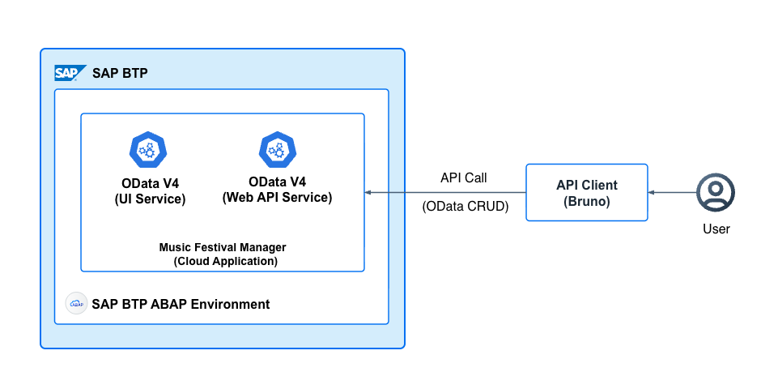
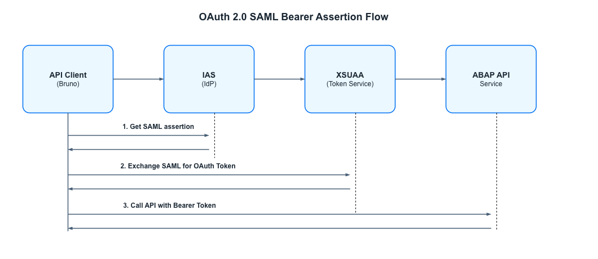

# Develop and Publish API for External System Integration

Imagine making your Music Festival Manager application data available to external systems through a secure API. For instance, you might expose an OData V4 service that allows external systems to programmatically create, read, update, and delete music festival data.

This tutorial describes how to expose your RAP business objects as an OData V4 API that can be consumed by external systems, tested with API clients such as Bruno, and secured using Basic Authentication or OAuth 2.0 Principal Propagation.

## Architecture Overview

The following diagram illustrates the high-level architecture for exposing an OData V4 API for external consumption:

<p align="center">
    
</p>


**Key Components:**
- **RAP Business Objects**: The core business logic and data model
- **API Projection CDS Views**: Lean views without UI-specific annotations for API consumption
- **Service Binding (OData V4 Web API)**: Exposes the API for external access
- **Communication Management**: Defines how external systems authenticate and connect

## Overview

The RAP services created in [Developing Business Objects](./12-Develop-BTP-ABAP-RAP-Application.md) are built for SAP Fiori elements UI. Therefore, the entities are draft-enabled to support multi-step editing workflows. When a service is called programmatically through an API, draft handling is not required and can complicate the call sequence unnecessarily.

For system-to-system integration or external consumption, you must create a separate Web API service binding that provides:
- A lean interface without UI-specific overhead.
- Simplified request/response patterns suitable for automation

For more information, see [Develop Web APIs using ABAP RAP](https://help.sap.com/docs/abap-cloud/abap-rap/develop-web-apis).

---

## Step 1: Create Data Element for Music Festival ID

Create the data element for the Music Festival ID field. It serves as the alternate key for API access:

| Data Element | Type | Length | Description |
|:-------------|:-----|:-------|:------------|
| ZPRA_MF_MUSIC_FESTIVAL_ID | NUMC | 10 | Music Festival ID |

Follow the steps described in [Creating Data Elements](https://help.sap.com/docs/abap-cloud/abap-development-tools-user-guide/creating-data-elements).

---

## Step 2: Add Music Festival ID to Database Table

The Music Festival ID serves as an alternate key that allows external systems to reference music festivals using a human-readable identifier instead of the technical UUID.

1. In ADT, open your database table named `ZPRA_MF_A_MF`.
2. Update the table definition to include the `id` field:

```cds
@EndUserText.label : 'Music festivals data'
@AbapCatalog.enhancement.category : #NOT_EXTENSIBLE
@AbapCatalog.tableCategory : #TRANSPARENT
@AbapCatalog.deliveryClass : #A
@AbapCatalog.dataMaintenance : #RESTRICTED
define table zpra_mf_a_mf {

  key client            : abap.clnt not null;
  key uuid              : sysuuid_x16 not null;
  id                    : zpra_mf_music_festival_id not null;
  title                 : zpra_mf_title;
  description           : zpra_mf_description;
  event_date_time       : zpra_mf_date_time;
  max_visitors_number   : zpra_mf_max_visitors_number;
  free_visitor_seats    : zpra_mf_free_visitor_seats;
  visitors_fee_amount   : zpra_mf_price;
  visitors_fee_currency : zpra_mf_currency_code;
  status                : zpra_mf_music_fest_status_code;
  created_by            : abp_creation_user;
  created_at            : abp_creation_utcl;
  last_changed_at       : abp_lastchange_utcl;
  local_last_changed_at : abp_lastchange_utcl;
  last_changed_by       : abp_lastchange_user;
  project_id            : abap.char(24);

}
```

3. Save and activate the table.
4. Regenerate the draft table `ZPRA_MF_D_MF` and ensure it is saved and activated in the system.

> **Note**: The `id` field is used as an alternate key in the behavior definition, allowing external systems to query music festivals by their human-readable ID using the `GetByAltKey` function.

## Step 3: Add ID Field to Base CDS View

Update the base CDS view (under *Data Definition*) named `ZPRA_MF_R_MUSICFESTIVAL` to include the new sponsoring fields.

1. In ADT, open `ZPRA_MF_R_MUSICFESTIVAL`.
2. Add the following field to the view after `Uuid`.

```cds
id as ID,
```

3. Save and activate your changes.

---

## Step 4: Add ID Field to Behavior Definition

Update the *Behavior Definition* named `ZPRA_MF_R_MUSICFESTIVAL` to include the new id field.

1. In ADT, open `ZPRA_MF_R_MUSICFESTIVAL`.
2. Add the field ID to the view after `uuid`.

```cds
mapping for zpra_mf_a_mf corresponding extensible
    {
      Uuid                = uuid;
      ID                  = id;
      Title               = title;
      Description         = description;
      EventDateTime       = event_date_time;
      MaxVisitorsNumber   = max_visitors_number;
      FreeVisitorSeats    = free_visitor_seats;
      VisitorsFeeAmount   = visitors_fee_amount;
      VisitorsFeeCurrency = visitors_fee_currency;
      Status              = status;
      CreatedBy           = created_by;
      CreatedAt           = created_at;
      LastChangedAt       = last_changed_at;
      LastChangedBy       = last_changed_by;
      LocalLastChangedAt  = local_last_changed_at;
      SalesOrderId        = sales_order_id;
      BusinessPartnerId   = business_partner_id;
      BusinessPartnerName = business_partner_name;
    }
```

3. Save and activate your changes.

---

## Step 5: Create API Projection CDS Views

Create projection views specifically for the API that expose only the necessary fields and exclude UI-specific annotations and draft-related elements.

### 5.1 Music Festival API Projection (ZPRA_MF_C_MUSICFESTIVAL_API)

1. Right-click on your package `ZPRA_MF_SERVICE` and choose *New > Data Definition*.
2. Enter the following details:
   - **Name**: `ZPRA_MF_C_MUSICFESTIVAL_API`
   - **Description**: Projection for Music Festival API Service
3. Choose *Next*, select a transport request, and choose *Finish*.
4. The following code snippet defines the specific fields exposed within the API response body, ensuring only the required data is returned in the response.

```cds
@AccessControl.authorizationCheck: #CHECK
@EndUserText.label: 'Projection of Music Festival API Service'
@Metadata.allowExtensions: true
@ObjectModel.sapObjectNodeType.name: 'ZPRA_MF_A_MF'
@ObjectModel.semanticKey: [ 'ID' ]

define root view entity ZPRA_MF_C_MUSICFESTIVAL_API
  provider contract transactional_query
  as projection on ZPRA_MF_R_MUSICFESTIVAL

{
  key     Uuid,
          ID,
          Title,
          Description,
          EventDateTime,
          MaxVisitorsNumber,
          FreeVisitorSeats,

          @Semantics.amount.currencyCode: 'VisitorsFeeCurrency'
          VisitorsFeeAmount,
          VisitorsFeeCurrency,

          @Consumption.valueHelpDefinition: [ { entity: { name: 'ZPRA_MF_I_Music_Fest_Status_VH', element: 'Value' },
                                                useForValidation: true } ]
          @ObjectModel.text.element: [ 'StatusText' ]
          Status,

          /* Fetching the description via the association defined in the Base View */
          _Status.Description as StatusText,

          _Visits : redirected to composition child ZPRA_MF_C_VISIT_API,
          _Status
}
```

**Key differences from UI projection:**
- Uses `provider contract transactional_query` for API access (not draft-enabled)
- Excludes UI-specific virtual elements
- Excludes draft-related fields and annotations


### 5.2 Visitor API Projection (ZPRA_MF_C_VISITOR_API)

1. Create a new data definition with the following details:
   - **Name**: `ZPRA_MF_C_VISITOR_API`
   - **Description**: Projection for Visitor API Service

2. The following code snippet defines the specific fields exposed within the API response body, ensuring only the required data is returned in the response.

```cds
@EndUserText.label: 'Projection - ZPRA_MF_R_VISITOR API'
@AccessControl.authorizationCheck: #CHECK

define root view entity ZPRA_MF_C_VISITOR_API
  provider contract transactional_query
  as projection on ZPRA_MF_R_Visitor
{
 key Uuid,
     Name,
     Email,
   
   _Visits : redirected to ZPRA_MF_C_VISIT_API 
}
```


### 5.3 Visit API Projection (ZPRA_MF_C_VISIT_API)

1. Create a new data definition with the following details:
   - **Name**: `ZPRA_MF_C_VISIT_API`
   - **Description**: Visit API Projection

2. The following code snippet defines the specific fields exposed within the API response body, ensuring only the required data is returned in the response.

```cds
@Metadata.allowExtensions: true
@EndUserText.label: 'View Entity for Visitor API Service'
@AccessControl.authorizationCheck: #NOT_REQUIRED
@ObjectModel.sapObjectNodeType.name: 'ZPRA_MF_A_VSTR'
define view entity ZPRA_MF_C_VISIT_API
  as projection on ZPRA_MF_R_VISIT
{
   key Uuid,
   ParentUuid,
   VisitorUuid,
   ArtistIndicator,
   Status,
   _MusicFestival : redirected to parent ZPRA_MF_C_MUSICFESTIVAL_API,
   _Visitor          : redirected to ZPRA_MF_C_VISITOR_API,
   _VisitorVH
}
```

3. Choose **Activate All** and select `ZPRA_MF_C_MUSICFESTIVAL_API`, `ZPRA_MF_R_VISITOR API`, and `ZPRA_MF_A_VSTR`.

For more information, see [CDS Projection Views](https://help.sap.com/docs/abap-cloud/abap-rap/develop-apis-projecting-draft-bo-data-model).

---

## Step 6: Create Behavior Definition Projections for the API

This step involves defining the behavior projections to expose specific operations for both the **Music Festival** and **Visitor** entities. Unlike UI behavior definitions, API behavior definitions do not include draft handling.

### 6.1 Create Behavior Projection for Music Festival API

The primary behavior projection defines the actions and operations available at the root level of the API.

1. Right-click on the `ZPRA_MF_C_MUSICFESTIVAL_API` CDS view and choose *New Behavior Definition*.
2. Configure the following properties in the creation wizard:
   - **Name:** `ZPRA_MF_C_MUSICFESTIVAL_API`
   - **Description:** Music Festival API Behavior Projection
   - **Implementation Type:** Projection
3. Implement the following code to expose the CRUD operations and custom actions:

```cds
projection;
strict ( 2 );
use side effects;

define behavior for ZPRA_MF_C_MUSICFESTIVAL_API alias MusicFestival
{
  use create;
  use update;
  use delete;

  field ( readonly ) Uuid;
  use action publish;
  use action cancel;
  use function GetByAltKey;
  use key AlternativeKey;
  use association _Visits { create ;}
}

define behavior for ZPRA_MF_C_VISIT_API alias Visits
{
  use update;
  use delete;

  use action book;
  use action cancel;

  use association _MusicFestival;
  use association _Visitor;
}
```

### 6.2 Create Behavior Projection for Visitor API

Create a separate behavior projection for the **Visitor** entity to manage visitor data independently.

1. Right-click on the `ZPRA_MF_C_VISITOR_API` CDS view and choose *New Behavior Definition*.
2. Configure the following properties:
   - **Name:** `ZPRA_MF_C_VISITOR_API`
   - **Description:** Visitor API Behavior Projection
   - **Implementation Type:** Projection
3. Implement the following code to expose CRUD operations for visitors:

```cds
projection;
strict ( 2 );
use side effects;

define behavior for ZPRA_MF_C_VISITOR_API alias Visitor
{
  use create;
  use update;
  use delete;

}
```

### Key Technical Notes

- **Projection Type:** Using `projection` ensures that the API only exposes a subset of the business logic defined in the base behavior definition.
- **Strict Mode:** `strict ( 2 )` is applied to ensure that the latest syntax checks and best practices for RAP are enforced.
- **No Draft:** Unlike the UI behavior definition, this projection does not use draft handling, making it suitable for direct transactional API calls.

3. Save and activate your changes.

For more information, see [Behavior Definition Projection Views](https://help.sap.com/docs/abap-cloud/abap-rap/projection-behavior-definition).

> **Note**: The behavior projection exposes only the standard CRUD operations. Custom actions and determinations from the base behavior definition can be selectively included using `use action <action_name>;`.

---

## Step 7: Create Service Definition for API

1. Follow the steps described in [Service Definition and Service Binding Creation](https://help.sap.com/docs/abap-cloud/abap-rap/creating-service-definition-and-service-binding).
2. Enter the following details:
   - **Service Definition Name**: `ZPRA_MF_API_MUSICFESTIVAL`
   - **Description**: Service Definition for ZPRA_MF_C_MUSICFESTIVAL_API

3. Create the service definition exposing the API projection views.

```cds
@EndUserText: {
  label: 'Music Festival API Service'
}
@ObjectModel: {
  leadingEntity: {
   name: 'ZPRA_MF_C_MUSICFESTIVAL_API'
  }
}
define service ZPRA_MF_API_MUSICFESTIVAL {
  expose ZPRA_MF_C_MUSICFESTIVAL_API as MusicFestival;
  expose ZPRA_MF_C_VISITOR_API       as Visitor;
  expose ZPRA_MF_C_VISIT_API         as Visit;
}
```

**Key difference**: Expose the API Web projection views (`ZPRA_MF_C_MUSICFESTIVAL_API`, `ZPRA_MF_C_VISIT_API`, `ZPRA_MF_C_VISITOR_API`) instead of the UI projection views.

4. Save and activate your changes.

For more information, see [Service Definition](https://help.sap.com/docs/abap-cloud/abap-rap/service-definition).

---

## Step 8: Create Service Binding (OData V4 - Web API)

1. Follow the steps described in [Creating Service Binding](https://help.sap.com/docs/abap-cloud/abap-development-tools-user-guide/creating-service-binding)
2. Enter the following details:
   - **Service Binding Name**: `ZPRA_MF_API_MUSICFESTIVAL_O4`
   - **Description**: Service Binding for ZPRA_MF_API_MUSICFESTIVAL
   - **Binding Type**: **OData V4 - Web API**
   - Choose *Next*
   - Select the *Transport Request* and choose *Finish*.
3. Choose *Publish* to publish the service.

> **Important**: Unlike UI bindings, Web API bindings are designed for machine-to-machine communication and require a communication scenario for external access.

For more information, see [Service Binding](https://help.sap.com/docs/abap-cloud/abap-rap/service-binding).

---

## Step 9: Test the Service in ADT (Swagger UI)

After publishing the service binding, you can test the API directly in ADT:

1. Double-click on the Service Binding `ZPRA_MF_API_MUSICFESTIVAL_O4`.
2. In the *Service URL* section, you can see the relative service path.
3. Choose *Test* to access the *Swagger UI* where you can:
   - View the API schema and available operations
   - Test GET, POST, PATCH, and DELETE operations
   - View request and response payloads

> **Note**: Testing in ADT uses your current ADT session authentication. For external access, you must configure a communication scenario.

---

## Step 10: Create Communication Scenario

A communication scenario defines how external systems can communicate with your API.

Follow the steps described in [Creation of a Communication Scenario Object](https://help.sap.com/docs/btp/sap-business-technology-platform/defining-communication-scenario-including-authorization-values).

1. Enter the following details:
   - **Communication Scenario Name**: `ZPRA_MF_CS_MUSICFESTIVAL`
   - **Description**: Communication scenario for Music Festival API
2. Choose *Next*, select a transport request, and choose *Finish*.

3. In the Communication Scenario editor, add the inbound service:
   - Under *Inbound Services*, choose *Add*.
   - Select your inbound service: `ZPRA_MF_API_MUSICFESTIVAL_O4_0001_G4BA` (To identify the inbound service, look for the service binding that ends with *0001_G4BA*. This naming convention is applied automatically once the service definition is published.)

4. Configure the *Supported Authentication Methods*:
   - Basic
   - OAuth 2.0
   - X.509

5. On the *Authorizations* tab, do the following:

   - Choose the **Insert** icon located just above the table headers to create a new dedicated authorization object instance. Expand the newly generated row.
   - Select the **Activity Field**. Select the *ACTVT* row nested underneath your chosen authorization instance.
   - Configure the access rights: Look over to the right-hand ACTVT panel and check only the boxes corresponding to **Display and Update** access:

        - [ ] Create or generate (Leave Unchecked)
        - [x] Change (Check this box — represents Update/Modify)
        - [x] Display (Check this box — represents Read/View)
        - [ ] Delete (Leave Unchecked)


6. Save the communication scenario.
7. Choose **Publish Locally** to publish the communication scenario.

For more information, see [Communication Scenario](https://help.sap.com/docs/abap-cloud/abap-integration-connectivity/communication-scenario).

---

## Step 11: Configure Communication Management in SAP Fiori

Log in to your SAP BTP ABAP environment SAP Fiori launchpad to set up the communication configuration.

### 11.1 Create a Communication User (Technical User)

Follow the steps provided in [Create Communication Users](https://help.sap.com/docs/SAP_CPQ/f80fbcd4f1c74232839c30ce26886f07/f4b0478c64fc41a3a3bd33b1883ed9a9.html).

1. Enter the following details:
   - *User Name*: `API_TECHNICAL_USER`
   - *Description*: Technical user for API access
   - *Password*: Enter a secure password (note this for later use)

> **Note**: This username and password are used for Basic Authentication in Bruno.

For more information, see [Communication User](https://help.sap.com/docs/abap-cloud/abap-integration-connectivity/communication-user).

### 11.2 Create a Communication System

Follow the steps provided in [Create Communication Systems](https://help.sap.com/docs/SAP_S4HANA_CLOUD/0f69f8fb28ac4bf48d2b57b9637e81fa/1bfe32ae08074b7186e375ab425fb114.html).

1. In the *General* section, enter the following:
   - *System ID*: `ZPRA_MF_API_CLIENT`
   - *System Name*: External API Client System

2. In the *Technical Data* section, enter the following:
   - *Host Name*: `localhost` (or any placeholder for inbound calls)
   - To locate the endpoint, navigate to your **ABAP Environment** instance in the SAP BTP account and extract the *url* parameter from the Service key.
3. In the *Users for Inbound Communication* section, enter the following:
   - Choose *+* (Add).
   - Select the communication user created in Step 9.1: `API_TECHNICAL_USER`.
   - Authentication Method: *User ID and Password*

For more information, see [Communication System](https://help.sap.com/docs/abap-cloud/abap-integration-connectivity/communication-system).

### 11.3 Create a Communication Arrangement

Follow the steps described in [Create a Communication Arrangement](https://help.sap.com/docs/SAP_S4HANA_CLOUD/0f69f8fb28ac4bf48d2b57b9637e81fa/a0771f6765f54e1c8193ad8582a32edb.html).

1. Select your communication scenario: `ZPRA_MF_CS_MUSICFESTIVAL`.
2. Enter the following details:
   - *Arrangement Name*: `ZPRA_MF_API_ARRANGEMENT`

3. Under the *Common Data* section, enter the following:
   - *Communication System*: `ZPRA_MF_API_CLIENT` (the communication system created in Step 9.2)

4. Choose *Create*.

5. After creation, navigate to the *Inbound Services* section.
6. **Copy the Service URL** — this is the endpoint you use in Bruno.

   The URL format looks like this:
   ```
   https://<your-abap-system>.abap.<region>.hana.ondemand.com/sap/opu/odata4/sap/zpra_mf_api_musicfestival_o4/srvd_a2x/sap/zpra_mf_api/0001/
   ```

For more information, see [Communication Arrangement](https://help.sap.com/docs/abap-cloud/abap-integration-connectivity/communication-arrangement).

---

## Step 12: Test API with Bruno Using Basic Authentication

[Bruno](https://www.usebruno.com/) is an open-source API client that can be used to test your OData V4 API.

### 12.1 Configure Bruno for Basic Authentication

1. Open Bruno and create a new collection named `Music Festival API`.

2. Create a new request with the following details:
   - *Name*: Get Music Festivals
   - *Method*: GET
   - *URL*: Paste the service URL from the communication arrangement and append the entity set name:
     ```
     https://<your-abap-system>.abap.<region>.hana.ondemand.com/sap/opu/odata4/sap/zpra_mf_api_musicfestival_o4/srvd_a2x/sap/zpra_mf_api/0001/MusicFestival
     ```

3. Configure **Authentication**:
   - Go to the *Auth* tab.
   - Select *Basic Auth* and enter the following:
   - *Username*: `API_TECHNICAL_USER` (the communication user)
   - *Password*: The password you set when creating the user

4. Add *Headers*:
   ```
   Accept: application/json
   Content-Type: application/json
   ```

5. Choose *Send* to execute the request.

### 12.2 Sample API Requests

**GET all music festivals:**
```http
GET {{baseUrl}}/MusicFestival
Authorization: Basic <base64-encoded-credentials>
Accept: application/json
x-csrf-token : fetch
```

**GET a single music festival by key:**
```http
GET {{baseUrl}}/MusicFestival/{{uuid}}
Authorization: Basic <base64-encoded-credentials>
Accept: application/json
x-csrf-token : fetch
```

**CREATE a new music festival (POST):**
```http
POST {{baseUrl}}/MusicFestival
Authorization: Basic <base64-encoded-credentials>
Content-Type: application/json
Accept: application/json
x-csrf-token : <csrf-token>

{
  "Title": "Summer Music Fest 2024",
  "Description": "Annual summer music festival",
  "EventDateTime": "2024-07-15T18:00:00Z",
  "MaxVisitorsNumber": 5000,
  "VisitorsFeeAmount": 150.00,
  "VisitorsFeeCurrency": "EUR",
  "Status": "I"
}
```

**UPDATE a music festival (PATCH):**
```http
PATCH {{baseUrl}}/MusicFestival/{{uuid}}
Authorization: Basic <base64-encoded-credentials>
Content-Type: application/json
Accept: application/json
x-csrf-token : <csrf-token>

{
  "MaxVisitorsNumber": 6000
}
```

**DELETE a music festival:**
```http
DELETE {{baseUrl}}/MusicFestival/{{uuid}}
Authorization: Basic <base64-encoded-credentials>
```

---

## Step 13: Test API with OAuth 2.0 Principal Propagation (Optional)

> **Note**: OAuth 2.0 based authentication configuration is optional. If you are using Basic Authentication (as configured in Step 11 and Step 12), you can skip this step. OAuth 2.0 Principal Propagation is recommended for scenarios requiring user-specific authorization and identity propagation.

OAuth 2.0 with Principal Propagation allows you to propagate the identity of the calling user to the ABAP system, enabling user-specific authorization checks.

### 13.1 Overview of OAuth 2.0 SAML Bearer Assertion Flow

The Principal Propagation flow involves the following steps:
1. Obtain a SAML assertion from the Identity provider (IAS).
2. Exchange the SAML assertion for an OAuth token from XSUAA.
3. Use the OAuth token to call the ABAP API.

<p align="center">
    
</p>

### 13.2 Prerequisites

1. **XSUAA Service Instance**: You need an SAP Authorization and Trust Management (XSUAA) service instance bound to your application.
2. **Destination Configuration**: A destination configured in SAP BTP cockpit pointing to your ABAP system.

3. Follow the steps provided in [Test OAuth-Enabled Inbound Communication in SAP Using an API Client](https://community.sap.com/t5/technology-blog-posts-by-sap/how-to-test-oauth-enabled-inbound-communication-in-sap-using-an-api-client/ba-p/14077042).

4. Ensure the following configurations are set:
   - Set **Client Redirect URI Type** to *Loopback*.
   - Select the **Communication Scenario**: `ZPRA_MF_CS_MUSICFESTIVAL`


### 13.3 Troubleshooting OAuth Issues

| Error | Possible Cause | Solution |
|-------|---------------|----------|
| `401 Unauthorized` | Invalid or expired token | Regenerate the token |
| `403 Forbidden` | Missing scopes or roles | Check role assignments in SAP BTP cockpit |
| `invalid_grant` | SAML assertion expired | SAML assertions have short validity; regenerate |
| `invalid_client` | Wrong client credentials | Verify clientid and secret from service key |
| `audience mismatch` | Wrong resource URL | Ensure resource matches XSUAA URL |

For more information on SAML Bearer Assertion, see:
- [OAuth 2.0 SAML Bearer Assertion Flow](https://help.sap.com/docs/ABAP_PLATFORM_NEW/e815bb97839a4d83be6c4fca48ee5777/7573ffc0ae444443a23b9e661d77d637.html)
- [Principal Propagation Testing on Bruno](https://help.sap.com/docs/connectivity/sap-btp-connectivity-cf/principal-propagation)

---

## Step 14: Create OData Integration Tests

OData integration tests allow you to test your RAP services by simulating OData requests in ABAP Unit. These tests validate that your service behaves correctly end to end, including behavior implementations, validations, and determinations.

For more information, see [OData Integration Tests](https://help.sap.com/docs/abap-cloud/abap-rap/odata-integration-tests).

### 14.1 Generate Test Classes Automatically

Automated test class generation is available by following the procedures described in the **Test Class Generation** section under [Generating Test Classes](https://help.sap.com/docs/abap-cloud/abap-development-tools-user-guide/using-service-binding-editor-for-odata-v4-service?version=sap_btp).

---

Your OData V4 API is now ready for consumption by external systems and applications, with comprehensive test coverage.

---

## Next Steps

After exposing your API for external consumption, you may want to:
- [Integrate the application with SAP S/4HANA Cloud Public Edition](./40-Integration-with-S4-Public-Cloud.md) to consume SAP S/4HANA Public Edition APIs
- [Enhance your application with SAP S/4HANA Cloud Public Edition sponsoring data](./52-S4HANA-Sponsoring-Integration.md) to display sales order and business partner information from SAP S/4HANA Cloud Public Edition
