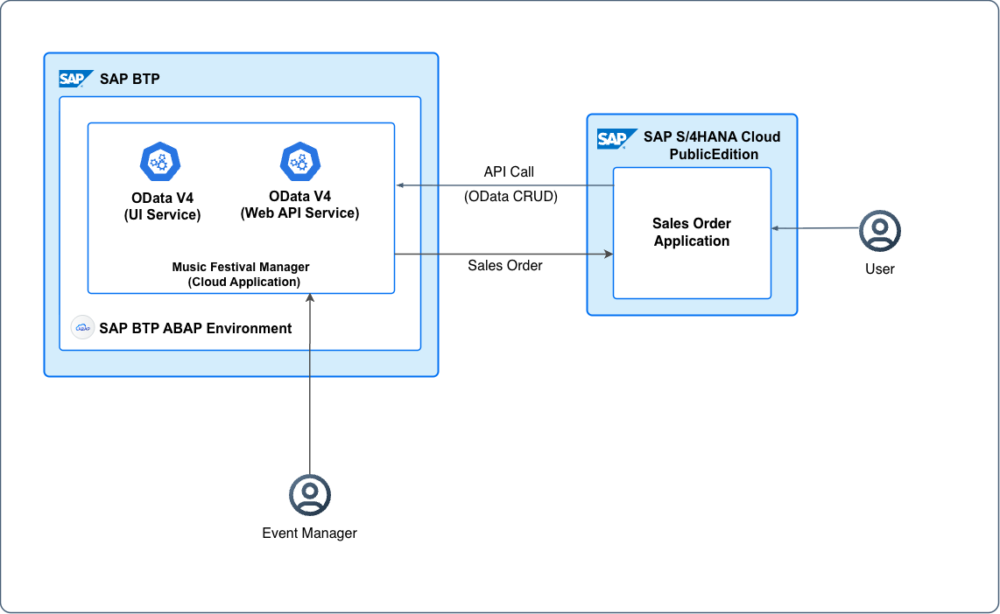

# Enhance the Application with SAP S/4HANA Cloud Public Edition Sponsoring Data

Imagine enhancing your Music Festival Manager application with information from an external system. For instance, you might reference a sales order from SAP S/4HANA Cloud Public Edition that includes the sponsoring of a music festival event.

This tutorial describes how to enhance your **Music Festival Manager** application with sponsoring information from SAP S/4HANA Cloud Public Edition. By linking sales orders and business partner data from SAP S/4HANA Cloud Public Edition to your music festivals, you can track sponsorship details and navigate directly to the source system.

## SAP S/4HANA Cloud Cross-Stack Integration Architecture

The following diagram illustrates how the SAP BTP ABAP system interacts with SAP S/4HANA Cloud Public Edition in this sponsoring integration scenario:

<p align="center">
    
</p>

Flow:
  1. The SAP S/4HANA Cloud Public Edition extension creates a sales order and calls the Music Festival API.
  2. The user views the sponsoring data on the SAP Fiori UI and can navigate back to SAP S/4HANA Cloud Public Edition.


This sponsoring scenario is designed to work with the [SAP S/4HANA CLoud Public Edition Cross-Stack Partner Reference Extension](https://github.com/SAP-samples/abap-partner-reference-application). In that scenario:

1. A custom SAP S/4HANA CLoud Public Edition extension creates a sales order for sponsoring a music festival.
2. The extension calls the Music Festival API (exposed in [Exposing OData V4 API for External Consumption](./51-Develop-OData-V4-API-Service.md)) to update the music festival with the sales order details.
3. The music festival UI displays the sponsoring information with a link back to the sales order.

For more details on the SAP S/4HANA Cloud Public Edition side of this integration, see [Integrate the Application with SAP S/4HANA Cloud Public Edition](./40-Integration-with-S4-Public-Cloud.md).

---

## Overview

Integrating external data extends the capabilities of the Music Festival Manager application. For example, you can link a festival event to an SAP S/4HANA Cloud Public Edition sales order containing sponsorship details.

When the API is triggered, the `MusicFestival` entity updates automatically. The UI then displays a new **Sponsoring Data** section showing the sales order ID and customer name, complete with direct navigation back to SAP S/4HANA Cloud Public Edition.

### What You Are Building

- Extend the data model with sponsoring fields (SalesOrderId, BusinessPartnerId, BusinessPartnerName)
- Create a virtual element for the sales order URL to enable navigation to SAP S/4HANA Cloud Public Edition
- Configure a communication system for hostname lookup
- Display sponsoring data in a new UI facet with conditional visibility
- Enable the API to receive sponsoring updates from SAP S/4HANA Cloud Public Edition

---

## Prerequisites

Before starting this tutorial, ensure you have completed the following:
- [Exposing OData V4 API for External Consumption](./51-Develop-OData-V4-API-Service.md): Enables external systems to modify sales order data programmatically through an OData API.
- Access to an SAP S/4HANA Cloud Public Edition system through navigation.

---

## Step 1: Create Data Elements for Sponsoring Fields

Create data elements for the new sponsoring fields as described in the following table:

| Data Element | Type | Length | Description |
|:-------------|:-----|:-------|:------------|
| ZPRA_MF_SALES_ORDER_ID | CHAR | 10 | Sales Order ID |
| ZPRA_MF_BUSINESS_PARTNER_ID | CHAR | 10 | Business Partner ID |
| ZPRA_MF_BUSINESS_PARTNER_NAME | CHAR | 80 | Business Partner Name |

Follow the steps as described in [Creating Data Elements](https://help.sap.com/docs/abap-cloud/abap-development-tools-user-guide/creating-data-elements).

---

## Step 2: Add Sponsoring Fields to Database Table

Extend your database table to include fields for integration with SAP S/4HANA Cloud Public Edition, such as sales order and business partner information.

1. In ADT, open your database table named `ZPRA_MF_A_MF`.
2. Update the table definition to include the sponsoring fields (sales_order_id, business_partner_id, and business_partner_name):

```cds
@EndUserText.label : 'Music festivals data'
@AbapCatalog.enhancement.category : #NOT_EXTENSIBLE
@AbapCatalog.tableCategory : #TRANSPARENT
@AbapCatalog.deliveryClass : #A
@AbapCatalog.dataMaintenance : #RESTRICTED
define table zpra_mf_a_mf {

   key client            : abap.clnt not null;
   key uuid              : sysuuid_x16 not null;
   id                    : zpra_mf_music_festival_id not null;
   title                 : zpra_mf_title;
   description           : zpra_mf_description;
   event_date_time       : zpra_mf_date_time;
   max_visitors_number   : zpra_mf_max_visitors_number;
   free_visitor_seats    : zpra_mf_free_visitor_seats;
   visitors_fee_amount   : zpra_mf_price;
   visitors_fee_currency : zpra_mf_currency_code;
   status                : zpra_mf_music_fest_status_code;
   created_by            : abp_creation_user;
   created_at            : abp_creation_utcl;
   last_changed_at       : abp_lastchange_utcl;
   local_last_changed_at : abp_lastchange_utcl;
   last_changed_by       : abp_lastchange_user;
   project_id            : abap.char(24);
   sales_order_id        : zpra_mf_sales_order_id;
   business_partner_id   : zpra_mf_business_partner_id;
   business_partner_name : zpra_mf_business_partner_name;

}
```

3. Save and activate the table.
4. Regenerate the draft table `ZPRA_MF_D_MF` and ensure it is saved and activated in the system.

---

## Step 3: Add Sponsoring Fields to Base CDS View

Update the base CDS view (under *Data Definition*) named `ZPRA_MF_R_MUSICFESTIVAL` to include the new sponsoring fields.

1. In ADT, open `ZPRA_MF_R_MUSICFESTIVAL`.
2. Add the following fields to the view after `project_id`.

```cds
sales_order_id        as SalesOrderId,
business_partner_id   as BusinessPartnerId,
business_partner_name as BusinessPartnerName,
```

3. Save and activate your changes.

---

## Step 4: Add Sponsoring Fields to Behavior Definition

Update the *Behavior Definition* named `ZPRA_MF_R_MUSICFESTIVAL` to include the new sponsoring fields.

1. In ADT, open `ZPRA_MF_R_MUSICFESTIVAL`.
2. Add the following fields to the view after `local_last_changed_at`.

```cds
mapping for zpra_mf_a_mf corresponding extensible
    {
      Uuid                = uuid;
      ID                  = id;
      Title               = title;
      Description         = description;
      EventDateTime       = event_date_time;
      MaxVisitorsNumber   = max_visitors_number;
      FreeVisitorSeats    = free_visitor_seats;
      VisitorsFeeAmount   = visitors_fee_amount;
      VisitorsFeeCurrency = visitors_fee_currency;
      Status              = status;
      CreatedBy           = created_by;
      CreatedAt           = created_at;
      LastChangedAt       = last_changed_at;
      LastChangedBy       = last_changed_by;
      LocalLastChangedAt  = local_last_changed_at;
      SalesOrderId        = sales_order_id;
      BusinessPartnerId   = business_partner_id;
      BusinessPartnerName = business_partner_name;
    }
```

3. Save and activate your changes.

---

## Step 5: Add Sponsoring Fields to API Projection

Update the API projection view named `ZPRA_MF_C_MUSICFESTIVAL_API` to expose the sponsoring fields for external consumption.

1. In ADT, open `ZPRA_MF_C_MUSICFESTIVAL_API`.
2. Add the following fields to enable external systems to read and update sponsoring data:

```cds
SalesOrderId,
BusinessPartnerId,
BusinessPartnerName,
```

3. Save and activate your changes.

These fields allow external systems (like SAP S/4HANA CLoud Public Edition) to update music festivals with sponsoring information through the API.

---

## Step 6: Create Communication System for SAP S/4HANA CLoud Public Edition Host Name

To enable navigation to sales orders in SAP S/4HANA CLoud Public Edition, you need to configure a communication system that stores the SAP S/4HANA CLoud Public Edition host name. This hostname is used to construct the sales order URL dynamically.

1. Open the *Communication Systems* app in SAP Fiori launchpad.
2. Choose *New* and enter the following details:
   - **System ID**: `ZPRA_MF_S4HC`
   - **System Name**: SAP S/4HANA Cloud System

3. Under *Technical Data*, enter the host name of your SAP S/4HANA Cloud Public Edition system:
   - *Host Name*: Enter your SAP S/4HANA Cloud Public Edition host name (e.g., my12345.s4hana.ondemand.com).

4. Save the communication system.

The host name configured here is used to construct the sales order URL for navigation.

---

## Step 7: Configure UI Projection Virtual Elements for Navigation and Field Visibility Control

The `ZPRA_MF_C_MUSICFESTIVALTP` UI projection view needs virtual elements to enable:
- **SalesOrderUrl**: Constructs a clickable URL to navigate to the sales order in SAP S/4HANA Cloud Public Edition
- **HideSponsoringData**: Controls visibility of the sponsoring section (hides when no sales order is linked)

### 7.1 Update the UI Projection CDS View

1. In ADT, open your UI projection CDS view named `ZPRA_MF_C_MUSICFESTIVALTP`.
2. Add the sponsoring fields and virtual elements:

```cds
@Consumption.semanticObject: 'SalesOrder'
@Consumption.semanticObjectMapping.element: 'SalesOrder'
SalesOrderId,

@ObjectModel.virtualElementCalculatedBy: 'ABAP:ZCL_PRA_MF_CALC_MF_ELEMENTS'
@UI.hidden: true
virtual SalesOrderUrl : abap.string(256),

@ObjectModel.virtualElementCalculatedBy: 'ABAP:ZCL_PRA_MF_CALC_MF_ELEMENTS'
@UI.hidden: true
virtual HideSponsoringData : abap_boolean,

BusinessPartnerId,
BusinessPartnerName,
```

3. Save and activate your changes.

### 7.2 How Virtual Elements Are Calculated

The virtual elements `SalesOrderUrl` and `HideSponsoringData` are calculated by the [ZCL_PRA_MF_CALC_MF_ELEMENTS](../objects/CLAS/ZCL_PRA_MF_CALC_MF_ELEMENTS/) class. The calculation logic works as follows:

- **SalesOrderUrl**: The URL is constructed by fetching the host name from the `ZPRA_MF_S4HC` communication system using the `get_host_from_comm_system` method and appending the SAP Fiori launchpad path. Alternatively, if configured as described in [Integrate the SAP BTP Application with SAP S/4HANA Cloud Public Edition](./40-Integration-with-S4-Public-Cloud.md), the host name is retrieved from the communication arrangement using the `get_host_from_comm_arrangement` method.

- **HideSponsoringData**: Returns `abap_true` when `SalesOrderId` is empty (to hide the sponsoring section), and `abap_false` when a sales order is linked (to show the sponsoring section)

---

## Step 8: Add Sponsoring Data UI Section

Create a new UI facet to display the sponsoring data in the Music Festival object page.

### 8.1 Update the Metadata Extension

1. Open the metadata extension for your UI projection view.
2. Add a new facet for Sponsoring Data:

```cds
@UI.facet: [
  {
    id: 'SponsoringData',
    type: #FIELDGROUP_REFERENCE,
    label: 'Sponsoring Data',
    targetQualifier: 'SponsoringData',
    hidden: #(HideSponsoringData)
  }
]

@UI.fieldGroup: [{ qualifier: 'SponsoringData', position: 10, type: #WITH_URL, url: 'SalesOrderUrl' }]
SalesOrderId;

@UI.fieldGroup: [{ qualifier: 'SponsoringData', position: 20 }]
BusinessPartnerId;

@UI.fieldGroup: [{ qualifier: 'SponsoringData', position: 30 }]
BusinessPartnerName;
```

3. Save and activate your changes.

### Key Features

- **Conditional Visibility**: The `hidden: #(HideSponsoringData)` annotation hides the sponsoring section when no sales order is linked.
- **Clickable Sales Order ID**: The `#WITH_URL` type enables navigation to the sales order in SAP S/4HANA Cloud Public Edition.

---

## Step 9: Configure SAML 2.0 Trust for Single Sign-On

To enable seamless single sign-on (SSO) when navigating from your SAP BTP application to SAP S/4HANA Cloud Public Edition, configure the trust relationship between both systems.

### Prerequisites

Ensure that the [SAML 2.0 trust configuration](./40-Integration-with-S4-Public-Cloud.md#configuring-trust-using-saml-20) is complete for seamless single sign-on between the SAP BTP application and SAP S/4HANA Cloud Public Edition.

> **Important**: For single sign-on to work, always login to the Cloud ABAP Environment Instance using the correct custom identity provider that is linked to the IAS tenant of the SAP S/4HANA Cloud Public Edition system.

For detailed steps on configuring SAML 2.0 trust, see [Integrate the SAP BTP Application with SAP S/4HANA Cloud Public Edition](./40-Integration-with-S4-Public-Cloud.md).

---

## Step 10: Test the Integration

### 10.1 Test Using API

Use the API exposed in [Exposing OData V4 API for External Consumption](./51-Develop-OData-V4-API-Service.md) to update a music festival with sponsoring data:

```http
PATCH {{baseUrl}}/MusicFestival/{{uuid}}
Authorization: Basic <credentials>
Content-Type: application/json
x-csrf-token : <csrf-token>

{
  "SalesOrderId": "1000000001",
  "BusinessPartnerId": "10000001",
  "BusinessPartnerName": "ACME Corporation"
}
```

### 10.2 Test the UI

1. Open the **Music Festival Manager** application in SAP Fiori launchpad.
2. Navigate to a music festival that has sponsoring data.
3. Verify that the **Sponsoring Data** section is visible with:
   - Clickable **Sales Order ID** that navigates to SAP S/4HANA CLoud Public Edition
   - **Business Partner ID** and Name displayed
4. Verify that music festivals without sponsoring data do not show the **Sponsoring Data** section.

---

## Summary

In this tutorial, you have:
- Extended the data model with sponsoring fields (SalesOrderId, BusinessPartnerId, BusinessPartnerName)
- Configured a communication system to store the SAP S/4HANA Cloud Public Edition host name
- Added sponsoring fields to the API projection for external consumption
- Created virtual elements (SalesOrderUrl, HideSponsoringData) for navigation and conditional UI visibility
- Added a conditionally visible **Sponsoring Data** section to the UI

This integration enables a seamless cross-stack scenario where SAP S/4HANA Cloud Public Edition extensions can update music festivals with sponsoring information, and users can navigate directly to the source sales order in SAP S/4HANA Cloud Public Edition.
