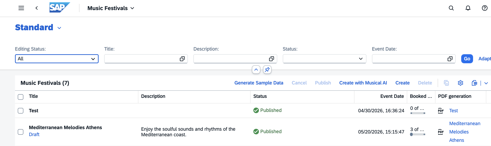

# Troubleshooting Guide

## Updating the Music Festival Application to 2604 release from Previous Versions

If you're upgrading from a previous version where `ZPRA_MF_NAME` was defined as `STRING`, you need to adjust the database table accordingly. This change was necessary because `STRING` fields are stored as LOB columns in SAP HANA, which don't support `CONTAINS` predicates used by OData `$filter` search operations without a fuzzy search index.

**Steps to upgrade:**

1. Delete all existing music festival and visitor records from the **Music Festivals** and **Visitors** apps to clear the active database tables.

2. Ensure no draft data exists. If any records show **Draft** status (see image below), save or discard them before you proceed.

   

3. In ADT, open the `ZPRA_MF_NAME` data element and change the **Data Type** from `String` to `CHAR` with a length of `255`. Save and activate your changes.

4. Verify that all dependent CDS views and behavior definitions are active without errors.

> **Note**: For detailed guidance on choosing between `STRING` and `CHAR` data types, see the [Data Elements section](./Tutorials/12-Develop-BTP-ABAP-RAP-Application.md#data-elements) in Developing BTP ABAP RAP Applications - Data Modeling and OData Service Generation.
## Updating the Music Festival Application after 2604 release

No change required for Database adoption